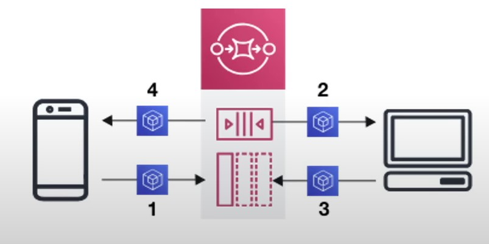
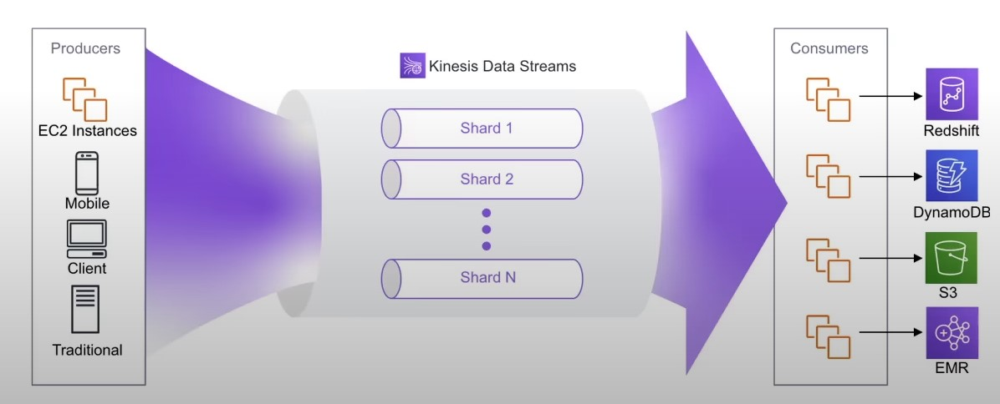
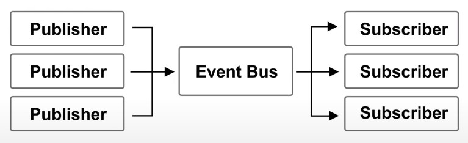
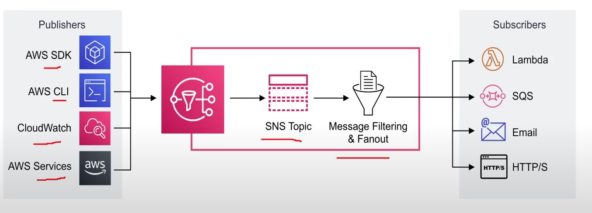

- [Queueing (SQS) ](#queueing-sqs)
- [Streaming and Kinesis](#streaming-and-kinesis)
- [Pub-Sub and SNS](#pubsub-sns)
    - [What is Pub/Sub ?](#what-is-pub-sub)
---
## Queueing (SQS) 
---
- <b> What is Messaging System ?</b>
    - Used to provide asynchronous communication and decouple processes via messages / events from sender and receiver (producer and consumer)

- <b> What is Queuing System ?</b>
    - A queueing system is a <u> messaging system that generally will <b> delete </b> messages once they are consumed </u>.
    - Simple Communication
    - <u> <i> Not Real-time </u> </i>
    - Have to pull
    - Not reactive

- <b> Simple Queuing System (SQS) </b>
    - Fully managed <b><u> queuing service that enables you to decouple </u> </b>and scale mircroservices, distributed systems, and serverless applications 
    - Use Case: You need to queue up transaction emails to be sent 
    - e.g. Signup, Reset Password

    

---
## Streaming and Kinesis
---
- <b> What is Streaming ? </b>
    - Multiple consumers can <b> react </b> to events (messages)
    - Events live in the stream for long periods of time, so complex operations can be applied 
    - <b><u> Real-time </u> </b>
    - <b> Amazon-Kinesis </b>
        - Amazon Kinesis is the AWS fully managed solution for collecting, processing and <u> analyzing streaming data in the cloud </u>

        

---
## Pub-Sub and SNS
---
-  ### <b> What is Pub / Sub ? </b>
    - Publish-subscribe pattern commonly <i> <u> implemented in <b> messaging systems. </b> </u></i>
    - In a pub/sub system the sender of messages <u> <b> (publishers)</b> do not send their messages directly to receivers.</u>
    -  They instead send their messages to an <u> <b> event bus </b> </u>. The <u> event bus categorizes their messages into groups</u>.
    - The receivers of messages <u> <b> Subscribers </u></b> subscribe to these groups
    - Whenever new messages appear within their subscription the messages are immediately delivered to them

        

    - Publisher have no knowledge of who their subscribers are
    - Subscribers do not pull for messages
    - Messages are instead <u> automatically and immediately pushed to subscribers</u>
    - Messages and events are interchangeable terms in pub/sub 
    - Use case:
        - A real-time chat system
        - A web-hook system
- ### <b> Simple Notification Service </b>
    - It is a highly available, durable, secure,  <u> <b> fully managed pub/sub messaging service </b> </u> that enables you to  <i> <u> decouple</u> microservices, distributed systems and serverless applications </i>

    

