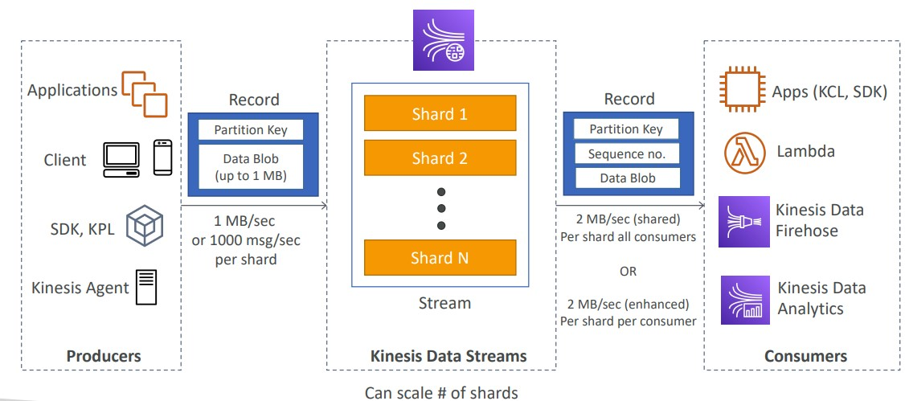
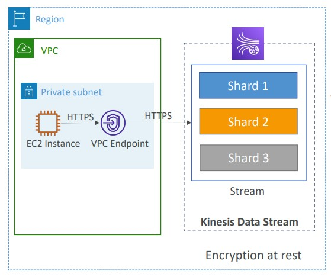
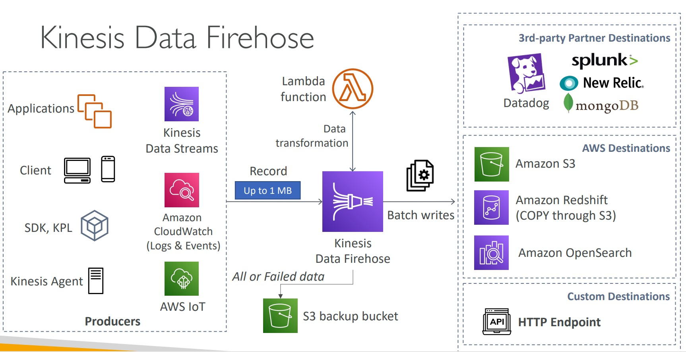

- [Queueing (SQS) ](#queueing-sqs)
- [SQS Message Visibility Timeout](#sqs-message-visibility-timeout)
- [Long Polling](#long-polling)
- [Streaming and Kinesis](#streaming-and-kinesis)
    - [Kinesis Data Streams](#kinesis-data-streams)
    - [Kinesis Data Firehose](#kinesis-data-firehose)
    - [Kinesis Data Streams vs Firehose](#kinesis-data-streams-vs-firehose)
    - [Kinesis Data Analytics](#kinesis-data-analytics)
    - [Kinesis Video Streams](#kinesis-video-streams)
- [Pub-Sub and SNS](#pubsub-sns)
    - [What is Pub/Sub ?](#what-is-pub-sub)
- [SQS and SNS - Fan Out Pattern](#sqs-and-sns---fan-out-pattern)
---
## Queueing (SQS) 
---
- <b> What is Messaging System ?</b>
    - Used to provide asynchronous communication and decouple processes via messages / events from sender and receiver (producer and consumer)

- <b> What is Queuing System ?</b>
    - A queueing system is a <ins> messaging system that generally will <b> delete </b> messages once they are consumed </ins>.
    - Simple Communication
    - <ins> <i> Not Real-time </ins> </i>
    - Have to pull
    - Not reactive

- <b> Simple Queuing System (SQS) </b>
    - Fully managed <b><ins> queuing service that enables you to decouple </ins> </b>and scale mircroservices, distributed systems, and serverless applications 
    - Use Case: You need to queue up transaction emails to be sent 
    - e.g. Signup, Reset Password
    - Default retention <ins>4 Days and Max of 14 days</ins>
    - Limitation of 256 KB per message sent
    - Low Latency (<10ms on publish and receive)
    - Can have <ins>duplicate messages</ins> (at least once delivery, occasionally)
    - <Strong><ins> Unlimited Throughput </strong></ins>

    
    
    - Encryption:
        - In-flight encryption using HTTPS API
        - At-rest encryption using KMS keys 
        - Client-side encryption if the client wants to perform encryption/decryption itself

## SQS Message Visibility Timeout
---
- <strong><ins>After a message is polled by a customer it becomes invisible to other consumers</ins></strong>
- By default the " message visibility timeout" is 30 seconds 
- That means the message has 30 seconds to process
- If the message is not processed in the visibility timeout, it will be processed twice
- A consumer could call the `ChangeMessageVisibility` API to get more time
- If the visibility timeout is high(hours) and consumer crashes, reprocessing will take time
- If visibility <ins>timeout is too low (seconds)</ins>, we may <ins>get duplicates</ins>

## Long Polling
---
- When a consumer requests messages from the queue, it can optionally 'wait' for messages to arrive if there are none in the queue - <strong> Long Polling </strong>
- Long Polling decreases the number of API calls made to SQS while increasing the latency and efficiency of the application
- The wait time can be between 1 sec to 20 sec
- Long Polling is preferable to Short Polling 
- Long Polling can be enabled at the queue level or at the API level using `WaitTimeSeconds`

---
## Streaming and Kinesis
---
- <b> What is Streaming ? </b>
    - Multiple consumers can <b> react </b> to events (messages)
    - Events live in the stream for long periods of time, so complex operations can be applied 
    - <b><ins> Real-time </ins> </b>
    - <b> Amazon-Kinesis </b>
        - Amazon Kinesis is the AWS fully managed solution for collecting, processing and <ins> analyzing streaming data in the cloud </ins>

        
    ### Kinesis Data Streams
    - <strong><ins> Capture,process and store data streams</ins> </strong>
        
        - Security:
            
            
            
            - Control access/ authorization using IAM policies
            - Encryption in flight using HTTPS endpoints
            - Encryption at rest using KMS
            - You can implement encryption/decryption of data on client-side (harder)
            - VPC endpoints available for Kinesis to access within VPC 
             - <ins>Monitor API calls using CLoudTrail</ins>

    
    ### Kinesis Data Firehose
    - <strong><ins>load data streams into AWS data stores</strong></ins>
    - Pay for only data that is going through Firehose
    - Supports many data formats, conversions, 
    transformations, compression
     

    ### Kinesis Data Streams vs Firehose
    | Kinesis Data Streams | Kinesis Data Firehose|
    | ---------------------|----------------------|
    | - Streaming service for ingest at scale | - Load streaming data into S3 /Redshift /OpenSearch / 3rd Party /custom HTTP |
    | write Custom code (producer/consumer) | Fully managed |
    | Real-time (~200 ms) | Near real-time (buffer time min 60 sec) |
    | Managed scaling (shard splitting / merging) | Automatic scaling |
    | Data storage for <ins> 1 to 365 days </ins> | <ins>No data storage </ins>|
    | Supports replay capability | Doesn't support Capability |
    ### Kinesis Data Analytics
    - <strong><ins>analyze data streams with SQL or Apache Flink</strong></ins>
    ### Kinesis Video Streams
    - <strong><ins>Capture, process and store video streams</strong></ins>

---
## Pub-Sub and SNS
---
-  ### <b> What is Pub / Sub ? </b>
    - Publish-subscribe pattern commonly <i> <ins> implemented in <b> messaging systems. </b> </ins></i>
    - In a pub/sub system the sender of messages <ins> <b> (publishers)</b> do not send their messages directly to receivers.</ins>
    -  They instead send their messages to an <ins> <b> event bus </b> </ins>. The <ins> event bus categorizes their messages into groups</ins>.
    - The receivers of messages <ins> <b> Subscribers </ins></b> subscribe to these groups
    - Whenever new messages appear within their subscription the messages are immediately delivered to them

        

    - Publisher have no knowledge of who their subscribers are
    - Subscribers do not pull for messages
    - Messages are instead <ins> automatically and immediately pushed to subscribers</ins>
    - Messages and events are interchangeable terms in pub/sub 
    - Use case:
        - A real-time chat system
        - A web-hook system
- ### <b> Simple Notification Service </b>
    - It is a highly available, durable, secure,  <ins> <b> fully managed pub/sub messaging service </b> </ins> that enables you to  <i> <ins> decouple</ins> microservices, distributed systems and serverless applications </i>

    

## SQS and SNS - Fan Out Pattern
---
- Push once in SNS, receive in all SQS queues that are subscribers
    
- Fully decoupled : no data loss
- SNS - Message Filtering 
    - <strong><ins>JSON policy</strong> used to filter messages sent to SNS topic's subscriptions
    - If a subscription doesn't have a filter policy, it receives every message

