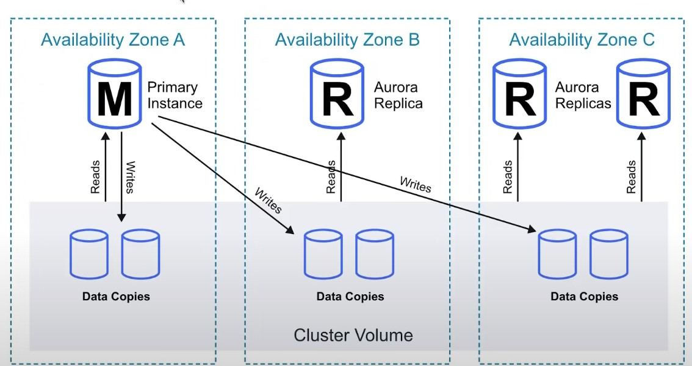
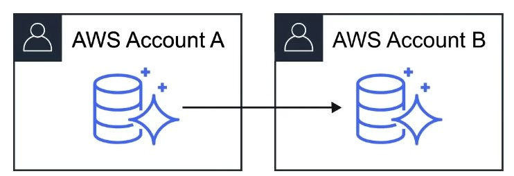

- [Aurora](#aurora)
- [Introduction to Aurora](#introduction-to-aurora)
- [Scaling with Aurora](#scaling-with-aurora)
- [Aurora Availability](#aurora-availability)
- [Fault Tolerance and Durability](#fault-tolerance-and-durability)
- [Aurora Replicas](#aurora-replicas)
- [Aurora Serverless](#aurora-serverless)
---
## Aurora
---

- Fully managed Postgres or MySQL compatible database designed by default to scale and fine-tuned to be really fast

---
## Introduction to Aurora
---
- Combines the speed and availability of high-end databases with the simplicity and cost-effectiveness of open source databases
- Aurora can run either MySQL or Postgres compatible engines 
- Aurora  MYSQL is <u> 5x better performance </u> than traditional MySQL
- Aurora Postgres is <u>3x better performance </u> than traditional Postgres
- 1/10th costs of other solutions offering similar performance and availability

---
## Scaling with Aurora
---
- Start with 10GB of storage, and scale in 10GB increments up to 64TB
- Storage is autoscaling
- Computing resources can scale all the way up to 32 vCPUs and 244GB of memory

---
## Aurora Availability
---
- A minimum of <u> 3 availability zones </u> each contain <u> 2 copies of your data at all times</u>.
- That means there are <b><i><u> 6 copies </b></i></u> 
- If in case you lose up to <u> 2 copies of your data </u> without affecting write availability
- If in case you lose up to <u> 3 copies of your data </u> without affecting read availability

    

---
## Fault Tolerance and Durability
---
- Aurora Backup and Failover is handled <u> automatically</u>
- <u> Snapshots of data </u> can be <b> shared </b> with other AWS accounts

     

- Storage is <u> self-healing </u>, in that data blocks and disks are continously scanned for errors and repaired automatically

---
## Aurora Replicas
---

|          | Amazon Aurora Replicas | Mysql Read Replicas |
| -------- | ---------------------- | ------------------- |
| Number of Replicas | Up to 15 | Up to 5 |
| Replication Type | Asynchronous(ms) | Asynchronous (s) |
|Performance impact on primary | Low | High |
| Act as failover target | Yes (no data loss) | Yes (potentially minutes of data loss) |
|  Automated failover | Yes |No|
| Support for user-defined replication delay | No | Yes | 
| Support for different data or schema vs primary | No | Yes |

---
## Aurora Serverless
---
- Aurora except the database will automatically start up, shut down, and scale capacity up or down based on your application's needs 
- Apps used a few minutes several times per day or week, eg. low-volume blog site
- pay for database storage and the database capacity and I/O your database consumes while it is active