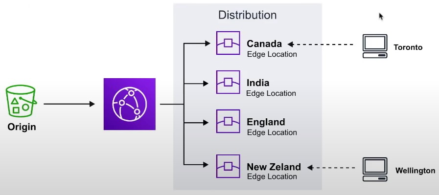
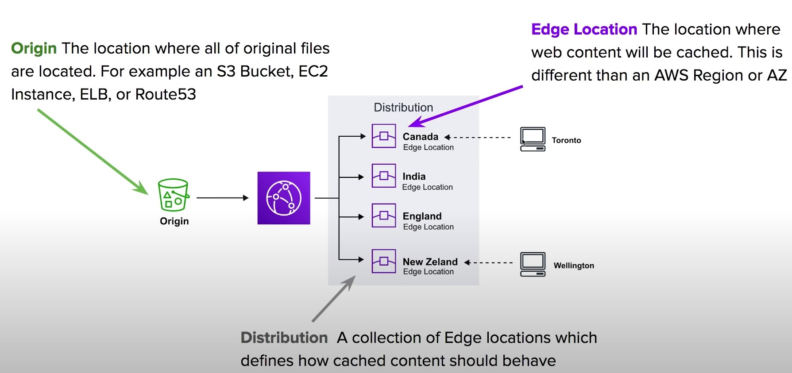
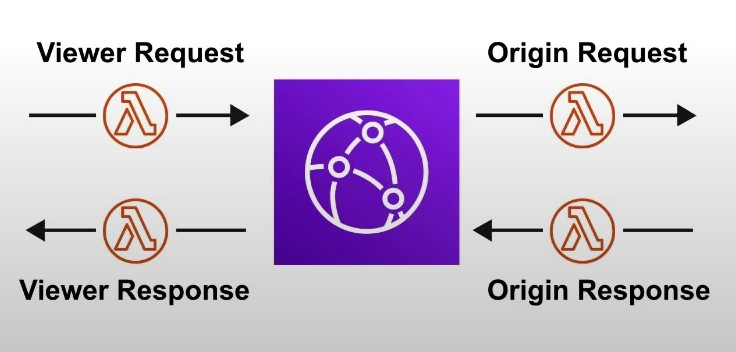
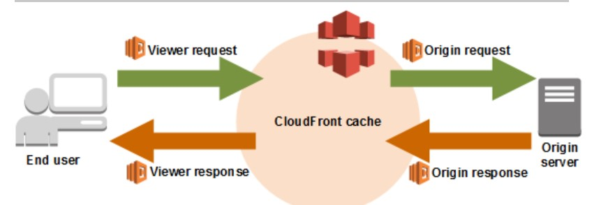

- [CloudFront](#cloudfront)
- [CloudFront Core Components](#cloudfront-core-components)
- [CloudFront Distributions](#cloudfront-distributions)
- [Lambda@Edge](#lambdaedge)
- [CloudFront Protection](#cloudfront-protection)
---
## CloudFront
---

- Content Distribution Network (CDN) creates cached copies of your website at various Edge locations around the world
- Content Delivery Network (CDN) 
    - A CDN is a distributed network of servers which delivers web pages and content to users based on their geographical location, the origin of the webpage and a content delivery server 
        - Can be used to deliver an entire website including static, dynamic and streaming
        - Requests for content are served from the nearest Edge Location for the best possible performance

        

---
## CloudFront Core Components
---
- <b> Origin </b> 
    - The location where all of original files are located. For example an S3 Bucket, EC2 Instance, ELB or Route53
- <b> Edge Location </B> 
    - The location where web content will be cached. This is different than an AWS Region or AZ
- <b> Distribution </b>
    - A collection of Edge locations which defines how cached content should behave

    

---
## CloudFront Distributions
---

- A distribution is a collection of Edge Location. You specific the Origin eg. S3, EC2, ELB, Route53
- It replicates copies based on your Price Class
- There are two types of Distributions 
    1. Web (for Websites)
    2. RTMP (for streaming media)
- <b> Behaviors </b>
    - Redirect to HTTPs, Restrict HTTP Methods, Restrict Viewer Access, Set TTLs
- <b> Invalidations </b>
    - You can manually invalidate cache on specific files via Invalidations 
- <b> Error Pages </b>
    - You can serve up custom error pages eg 404
- <b> Restrictions </b>
    - You can use Geo Restriction to blacklist or whitelist specific countries

---
## Lambda@Edge 
---
- Lambda@Edge functions are used to override the behavior of request and responses 
- Lambda@Edge lets you run Lambda functions to customize the content that CloudFront delivers, executing the functions in AWS locations closer to the viewer. 
- The functions run in response to CloudFront events, without provisioning or managing servers. You can use Lambda functions to change CloudFront requests and responses at the following points:

- The 4 Available Edge Functions 
    1. Viewer Request   
        - When CloudFront receives a request from a Viewer
    2. Origin request
        - Before CLoudFront forwards a request to the origin 
    3. Origin response
        - When cloudfront receives a response from the origin 
    4. Viewer response 
        - Before CLoudFront returns the response to the viewer

    
    

---
## CloudFront Protection
---

- By Default a Distribution allows everyone to have access
- Original Identity Access (OAI)
    - A virtual user identity that will be used to give your CloudFront Distribution permission to fetch a private object 
- Inorder to use Signed URLs or Signed Cookies you need to have an OAI
- <b> Signed URLs </b>
    - (Not the same thing as S3 Presigned URL)
        - A url with provides temporary access to cached objects 
- <b> Signed Cookies </b> 
    - A cookie which is passed along with the request to CloudFront. The advantage of using a Cookie is you want to provide access to multiple restricted files. eg. Video Streaming

