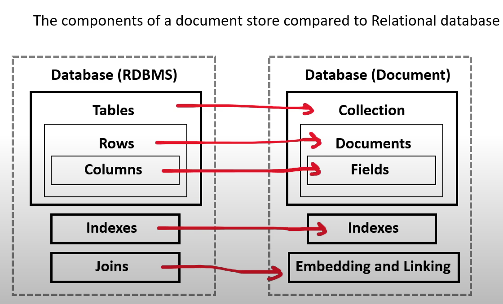

- [What is Database](#what-is-database)
- [What is Data Warehouse](#what-is-data-warehouse)
- [What is a key value store?](#what-is-a-key-value-store)
- [What is a document database?](#what-is-a-document-database)
- [NOSQL Database Services](#nosql-database-services)
    - [DynamoDB](#dynamodb)
    - [DocumentDB](#documentdb)
    - [Amazon Keyspaces](#amazon-keyspaces)
- [Relational Database Service](#relational-database-service)
- [Other Database Services](#other-database-services)
---
## What is Database ?
---
- <i> A database is data-store that store semi-structured and structured data</i>
- A database is more complex stores because it requires using formal design and modeling techniques
- Database types:
    - <b> Relational Database </b>
        - Structured data represents tabular data (tables,rows and columns)
    - <b> Non-Relational Database </b>
        - Semi-Structured that may or may not represent tabular data 
- Set of functionality:
    - query 
    - modeling strategies to optimize retrieval for different use cases
    - control over the transformation of the data into useful data structures or reports

---
## What is Data Warehouse ?
---

- Relational Database : designed for analytic workloads and a column-oriented data-store
- Companies will have terabytes and millions of rows of data 
- Data warehouses generally perform <ins> aggregation</ins>
    - aggregation is is grouping data eg. finding a total or average
    - Data warehouses are optimised around columns since they need quickly aggregate column data 
- Data warehouses are generally designed be HOT
    - HOT means they can return queries very fast even though they have vast amounts of data
- Data warehouses are infrequently accessed 
    - intended for real time reporting but maybe once or twice a day or once a week to generate business or user reports
- Data Warehouse needs to consume data from a relational database on a regular basis

---
## What is a Key Value Store ?
---
- <i> A key-value database is a type of non-relational database (NoSQL) that uses a simple key-value method to store data </i>
    - Stores a <ins> unique key </ins>  alongside a value
    - will interpret this data resembling a dictionary 
    - can resemble tabular data, it does not have to have the consistent columns per row
-Due to simple design so they can scale well beyond a relational database
 
---
## What is a document database ?
---
- Document store
    -<i> a NOSQL database that stores documents as its primary data-structure</i>
    - it could be an XML but more commonly is JSON or JSON-like
    - they are sub-class of key/value stores

        

----
## NOSQL Database Services
---- 
- ### DynamoDB
    - a serverless <ins> NOSQL key/Value and document database</ins>
    - designed to scale to billions of records  with consistent data return in at <ins>least a second- millisecond latency</ins>
    - It is AWS's <ins> flagship database service </U> meaning it is cost-effective and very fast 
    - <strong>DAX cluster</strong> for read cache, microsecond read latency
    - Event Processing: DynamoDB Streams to integrate with AWS Lambda, or Kinesis Data Streams
    - Global Table feature: active-active setup
    - Automated backups up to 35 days with PITR (restore to new table), or on-demand backups
    - Export to S3 without using RCU within the PITR window, import from S3 without using WCU
    - Great to rapidly evolve schema
    - It is a <ins>massively scalable database </ins>
    - <strong>Usecases:</strong> Serverless applications development (small documents 100s Kb), distributed serverless cache
- ### DocumentDB
    - A NOSQL <ins> document database </ins> that is <ins>"MongoDB compatible"</ins>
    - MongoDB is very popular NOSQL among developers there were open-source licensing issues around using open-source MongoDB , so aws got aorund it by just building their own MongoDB database
    - <i> when you want a MongoDB database </i>
- ### Amazon KeySpaces 
    - A fully managed <ins> Apache Cassandra database </ins>
    - Cassandra is an open-source NOSQL key/value database similar to DynamoDB in that is columnar store database but has some additional functionality
    - <i> when you want to use Apache Casandra </i>

---
## Relational Database Service
---

- ### Relational Database Services (RDS)
    - supports multiple SQL engines
    - Relational is synonymous with SQL and Online Transactional Processing (OLTP)
    - most commonly used type of database among tech companies and start ups
    - RDS supports the following SQL Engines:
       -  <b>MYSQL </b> - Most popular open source SQL database that was purchased and now owned by Oracle 
       -  <b> MariaDB </b> - When Oracle bought MYSQL. MariaDB made a fork (copy) of MYSQL was made under a different open-source license
       - <b> Postgres (PSQL) </b> - Most popular open-source SQL database among developers. Has rich-features over MYSQL but at added complexity
       - <b> Oracle </b> - Oracle's proprietary SQL database. Well used by Enterprise companies. Have to buy a license to use it
       - <b> Microsoft SQL Server </b> - Microsoft's proprietary SQL database. Have to buy license to use it
       - <b> Aurora </b> - Fully managed database 
            - <b> Aurora </b> 
                - fully managed database, 
                - database of either <ins>MYSQL (5X faster) and PSQL (3X faster) database </ins>
                - <i> When you want a highly available, durable, scalable and secure relational database for Postgres or MySQL then Aurora is correct fit</i>
        - <b> Aurora Serverless </b> 
                - serverless on-demand version of Aurora.
                - When you want "most" of the benefits of Aurora but can trade to have cold-starts or you don't have lots of traffic demand
        - <b> RDS on VMware </b>
                - allows you to deploy RDS supported engines to on-premise data center.
                - datacenter must be using VMware for server virtualization
                - when you want databases managed by RDS on your own datacenter

---
## Other Database Services
---
- <b> RedShift </b>
    - <ins> petabyte-size data-warehouse </ins>
    - Data warehouses
        - are for <ins>Online Analytical Procesing (OLAP)</ins>
        - can be expensive because they are keeping data "hot"
        - "HOT" means we can run a very complex query and a large amount of data and get that data very fast 
        - Usage: when you want to quickly generate analytics or reports from a large amount of data 
- <b> ElasticCache </b>
    - a managed database of the <ins> in-memory and caching open-source databases </ins>
    - Redis or Memcached 
    - Usage: when you want to <ins> improve the performance of application </ins> by adding a caching layer in-front of web-server or database
- <b> Neptune </b>
    - a managed <ins> graph database </ins>
    - Data is represented in interconnected nodes
    - Usage: when you need to understand the connections between data eg. Mapping Fraud Rings or Social Media Relationships
- <b> Amazon Timestreams </b>
    - a fully managed <ins>time series database</ins>
    - Related to Devices that send lot of data that are time-sensitive such as IOT devices 
    - Usage: When you need to measure how things change over time
- <b> Amazon Quantum Ledger Database </b>
    - a fully managed <ins> ledger database </ins> that provides <i> transparent, immutable and cryptographically variable transaction logs </i>
    - Usage: when you need to record history of financial activities that can be trusted
- <b> Database Migration Service </b>
    - a database migration service
    - Can migrate from:
        - On-premise database to AWS
        - from two database in different or same AWS accounts using SQL engines
        - from a SQL to NOSQL database

