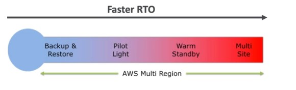
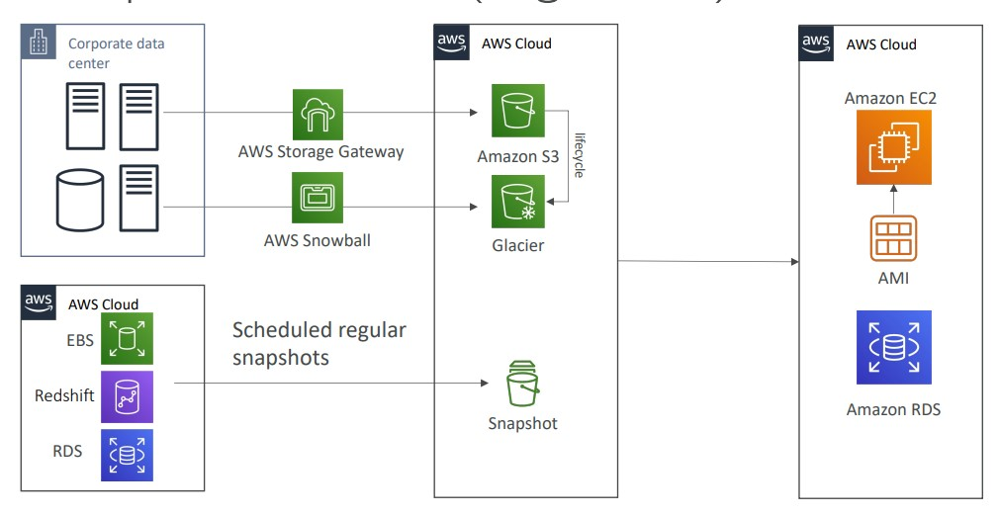
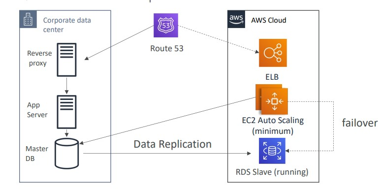
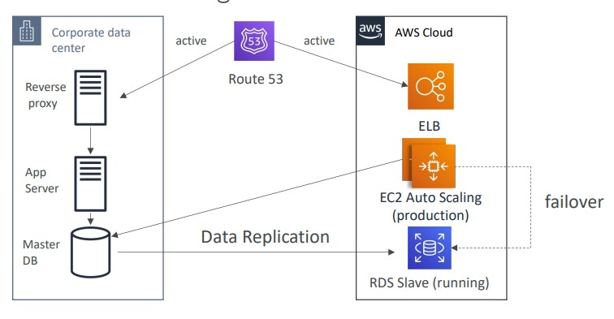
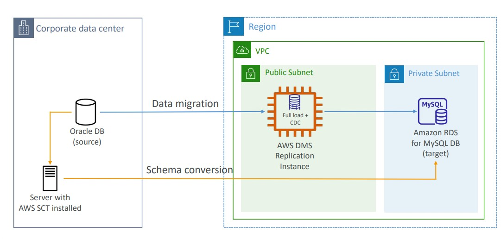

- [Disaster Recovery in AWS](#disaster-recover-in-aws)
- [Database Migration Service](#database-migration-service)
    - [Continuous Replication](#continuous-replication)
    - [Multi-AZ Deployment](#multi-az-deployment)
- [RDS & Aurora MySQL Migrations](#rds--aurora-mysql-migrations)
## Disaster Recovery in AWS
---
- Any event that has a negative impact on a company's business continuity or finances is a disaster 
- Disaster recovery (DR) is about preparing for and recovering from a disaster 
- What kind of disaster recovery?
    - On-premise => On-Premise: traditional DR and very expensive 
    - On-Premise => AWS cloud: hybrid recovery
    - AWS Cloud Region A => AWS Cloud Region B
- Disaster Recovery Strategies 
    

    

    - Backup and Restore
        
        

    - Pilot Light 
        - small version of the app is always running in the cloud 
        - Useful for the critical core (Pilot Light)
        - Very similar to Backup and Restore
        - Faster than Backup and Restore as critical systems are already up 

        

    - Warm Standby
        - Full system is up and running, but at minimum size 
        - Upon disaster we can scale to production load 

        

    - Hot Site/ Multi Site Approach
        - Very low RTO (minutes or seconds) - very expensive 
        - Full production scale is running AWS and On Premise

        

---
## Database Migration Service
---
### Continuous Replication

### Multi-AZ Deployment
- When Multi-AZ Enabled, DMS provisions and maintains a synchronously stand replica in a different AZ
    - Advantages:
        - Provide Data Redundancy 
        - Eliminates I/O freezes 
        - Minimizes latency spikes

---
## RDS & Aurora MySQL Migrations
---

