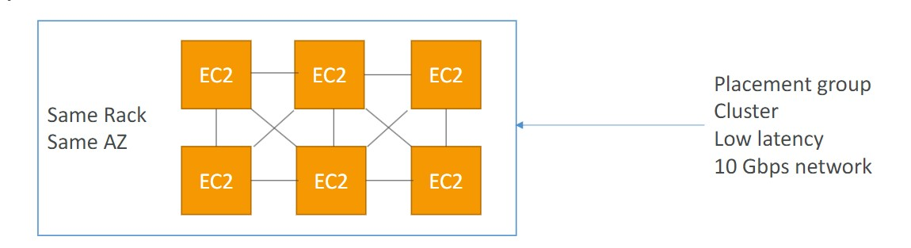
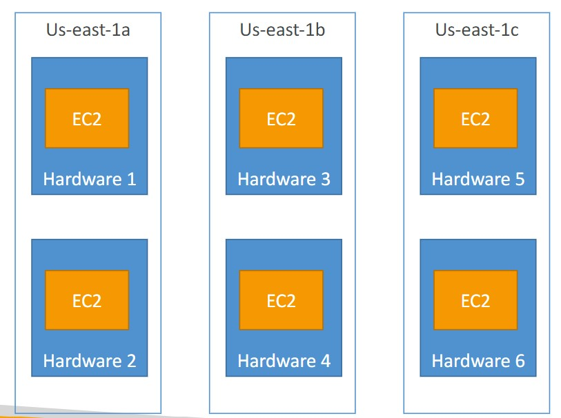
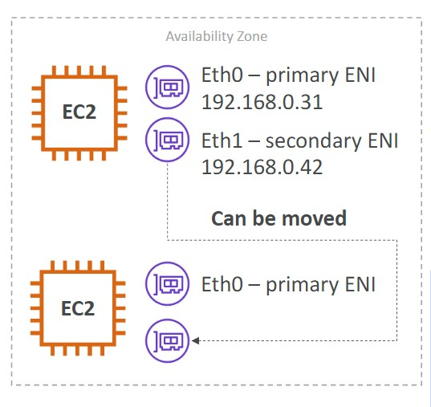

- [Placement Groups](#placement-groups)
- [Elastic Network Interfaces](#elastic-network-interfaces)

## Placement Groups
---
- Placement Groups Cluster
    - Pros: Great Network (10 Gbps bandwidth between instances)
    - Cons: If the rack fails, all instances fails at the same time 
    - Use cases:
        - Big Data job that needs to complete fast 
        - Application that needs extremely <ins> low latency and high network throughput </ins>
        
- Placement Group Spread
    - Pros:
        - Can span across Availability ZOnes (AZ)
        - Reduced risk is simultaneous failure
        - EC2 instances are on different physical hardware
    - Cons:
        - Limited to 7 instances per AZ per placement group
    - Use cases:
        - Application that needs to maximize high availability
        - Critical Applications where each instance must be isolated from failure from each other 

            

## Elastic Network Interfaces
---
- The ENI can have the following attributes:
    - Primary private IPV4, one or more secondary IPv4 
    - One ELastic IP (IPv4) per private IPv4
    - One or more Security Groups
    - A MAC address
- You can create ENI independently and attach them on fly (move them) on EC2 instances for failover 
- <i><strong><ins>Bound to a specific availability zone (AZ)</i></strong></ins>
    