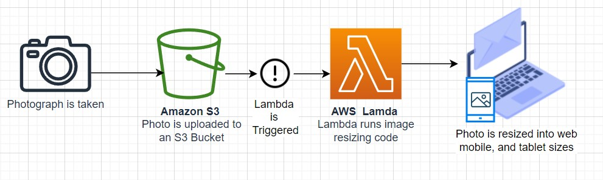
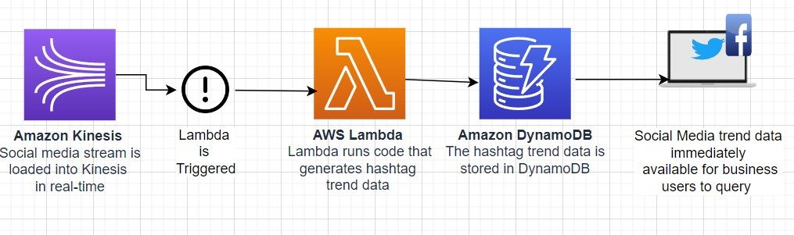

- [AWS Lambda](#aws-lambda)
- [How it works](#how-it-works)
- [File Processing Architecture](#file-processing-architecture)
- [Stream Processing Architecture](#stream-processing-architecture)
- [Use Cases](#use-cases)

---
## AWS Lambda
---
- Run code <ins> without thinking about servers or clusters</ins>
- Run code without provisioning or managing infrastructure. Simply write and <i> <ins> upload code as a .zip file or container image</ins></i>
- Automatically respond to code execution requests at any scale, from a dozen events per day to hundreds of thousands per second
- Save costs by <ins><b> paying only for the compute time you use </b></ins> by per millisecond instead of provisioning infrastructure upfront for peak capacity
- Optimize code execution time and performance with the right function memory size. Respond to high demand in double-digit milliseconds with Provisioned Concurrency.

---
## How it works
---

- AWS Lambda is a <ins><b> serverless, event-driven compute service that lets you run code for virtually any type of application </ins></b> or backend service without provisioning or managing servers.
- Ypu can trigger Lambda over 200 AWS services and software as a service (Saas) applications and only pay for what you use

---
## File Processing Architecture
---

---
## Stream Processing Architecture
---

---
## Use Cases 
---
- Quickly process data at scale
    - Meet resource-intensive and unpredictable demand by using AWS Lambda to instantly scale out to more than 18K vCPUs.
    - Build processing workflows quickly and easily with suite of other serverless offerings and event triggers
- Run interactive web and mobile backends
- Enable powerful ML insights
- Create event-driven applications