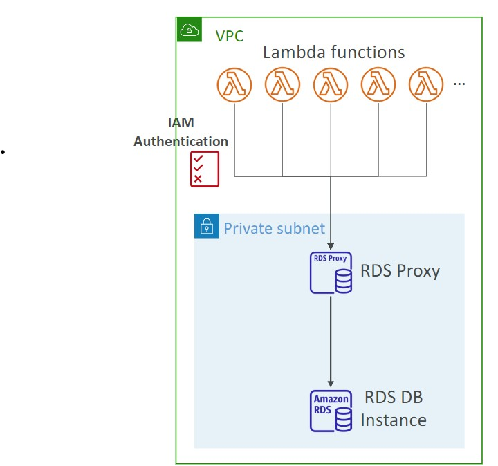
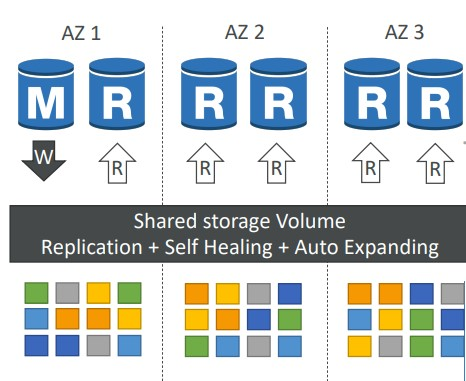

- [RDS](#rds)
- [RDS Proxy](#rds-proxy)
- [Aurora](#aurora)
- [Introduction to Aurora](#introduction-to-aurora)
- [Aurora Availability](#aurora-availability)
- [Fault Tolerance and Durability](#fault-tolerance-and-durability)
- [Aurora Replicas](#aurora-replicas)
- [Aurora Serverless](#aurora-serverless)

---
## RDS
---

---
## RDS Proxy
---

- Fully managed database proxy for RDS
- Allows apps to pool and share DB connections established with the database
- <ins><i>Improving database efficiency by reducing the stress on database resources (e.g CPU, RAM)and minimize open connections (and timeouts)</ins></i>
- Serverless, autoscaling, highly available (multi-AZ)
- Reduced RDS and Aurora failover time by up 66%
- Supports RDS (MySQL,PostgreSQL, MariaDB, MS SQL Server) and Aurora (MySQL, PostgreSQL)
- No code changes required for most apps
- <i>Enforce <ins>IAM authentication </ins> for DB, and securely store credentials in <ins>AWS Secrets Manager</ins></i>
- RDS proxy is <ins>never publicly accessible</ins>

---
## Aurora
---

- Fully managed Postgres or MySQL compatible database designed by default to scale and fine-tuned to be really fast
- Aurora <strong><ins>automatically grows in increments of 10GB, up to 128 TB</ins></strong>

---
## Introduction to Aurora
---
- Combines the speed and availability of high-end databases with the simplicity and cost-effectiveness of open source databases
- Aurora can run either MySQL or Postgres compatible engines 
- Aurora  MYSQL is <ins> 5x better performance </ins> than traditional MySQL
- Aurora Postgres is <ins>3x better performance </ins> than traditional Postgres
- <ins>Aurora Costs more than RDS (20% more) but is more efficient</ins>

---
## Aurora Availability
---
- 6 copies of your data in 3 AZ:
    - Needs only <ins>4 out of 6 copies for writes</ins> (so if one AZ is down then it is fine)
    - Need only <ins> 3 out of 6 for reads</ins>
    - self healing with peer-to-peer replication 
    - Storage is striped across 100s of volumes
- Automated failover for master happens in less than 30 seconds 
- Master + up to 15 Aurora Read Replicas serve reads 

---
## Fault Tolerance and Durability
---
- Aurora Backup and Failover is handled <ins> automatically</ins>
- <ins> Snapshots of data </ins> can be <b> shared </b> with other AWS accounts

     

- Storage is <ins> self-healing </ins>, in that data blocks and disks are continuously scanned for errors and repaired automatically

---
## Aurora Replicas
---

|          | Amazon Aurora Replicas | Mysql Read Replicas |
| -------- | ---------------------- | ------------------- |
| Number of Replicas | Up to 15 | Up to 5 |
| Replication Type | Asynchronous(ms) | Asynchronous (s) |
|Performance impact on primary | Low | High |
| Act as failover target | Yes (no data loss) | Yes (potentially minutes of data loss) |
|  Automated failover | Yes |No|
| Support for user-defined replication delay | No | Yes | 
| Support for different data or schema vs primary | No | Yes |

---
## Aurora Serverless
---
- Aurora except the database will automatically start up, shut down, and scale capacity up or down based on your application's needs 
- Apps used a few minutes several times per day or week, eg. low-volume blog site
- pay for database storage and the database capacity and I/O your database consumes while it is active