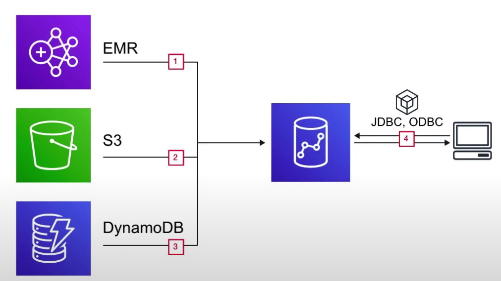
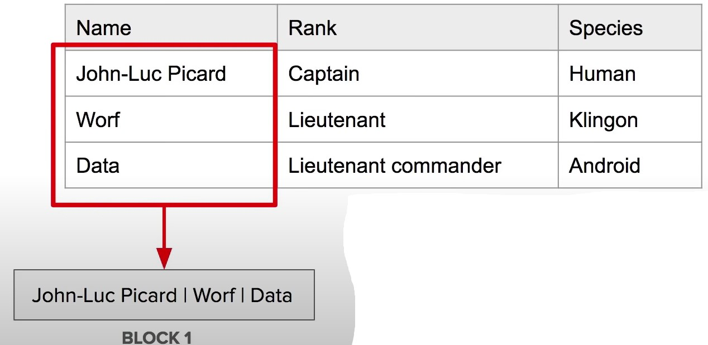

- [Amazon Redshift](#amazon-redshift)
- [What is Data Warehouse ?](#what-is-data-warehouse)
- [Introduction to Redshift](#introduction-to-redshift)
- [Redshift Use Case](#redshift-use-case)
- [Redshift Columnar Storage](#redshift-columnar-storage)
- [Redshift Configurations](#redshift-configurations)
---
## Amazon Redshift
---
- Fully managed <b> <u> Petabyte-size Data warehouse </u></b>. 
- Analyze (Run complex SQL queries) on massive amounts of data Columnar Store database

---
## What is Data Warehouse ?
---
- <b> What is Data Warehouse  ?</b>
    - A transaction symbolizes unit of work performed within a database management system
    - eg. reads and writes

| Database | Data warehouse |
| -------- | -------------- |
| Online Transaction Processing (OLTP) | Online Analytical Processing (OLAP) |
| A database was built to store current transactions and enable fast access to specific transactions for ongoing business processes | A data warehouse is built to store large quantities of historical data and enable fast, complex queries across all the data |
| Adding Items to your Shopping List | Generating Reports |
| Single Source | Multiple Source |
| Short transactions (small and simple queries ) with an emphasis on writes. | Long transactions (long and complex queries ) with an emphasis on reads |

---
## Introduction to Redshift
---
- AWS Redshift is the AWS managed, petabyte-scale solution for <u> Data Warehousing </u>
- Pricing starts at just <u> $0.25 per hour </u> with no upfront costs or commitments. 
- Scale up to petabytes for $1000 per terabyte , per year
- Redshift price is less than 1/10 cost of most similar services 
- Redshift is used for Business Intelligence
- Redshift uses <u> OLAP (Online Analytics Processing System)</u>
- Redshift is <b> <u> Columnar Storage Database  </u> </b>
- Columnar Storage for database tables is an important factor in optimizing analytic query performance because it <u> drastically reduces the overall disk I/O requirements </u> and reduces the amount of data you need to load from disk

---
## Redshift Use Case
---

- We want to continuously COPY data from 
    1. EMR
    2. S3 and
    3. DynamoDB
    - to power a customer Business Intelligence tool
- Using a third-party library we can connect and query Redshift for data. 

    

---
## Redshift Columnar Storage
---
- Columnar Storage stores data together as columns instead of rows

    

- OLAP applications look at multiple records at the same time. You save memory because you fetch just the columns of data you need instead of whole rows
- Since data is stored via column, that means all data is of the same data-type allowing for easy compression

---
## Redshift Configurations 
---
- <b> Single Node </b>
    - Nodes come in sizes of 160Gb. You can launch a single node to get started with Redshift 
- <b> Multi-Node </b>
    - You can launch a cluster of nodes with Multi Node mode 
- <b> Leader Node </b>
    - Manages client connections and receiving 