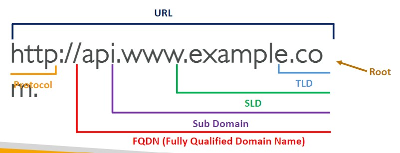
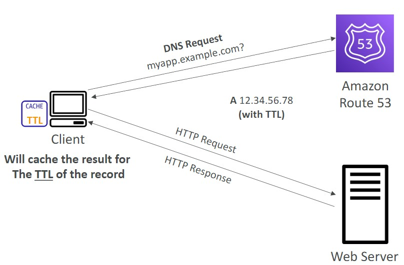
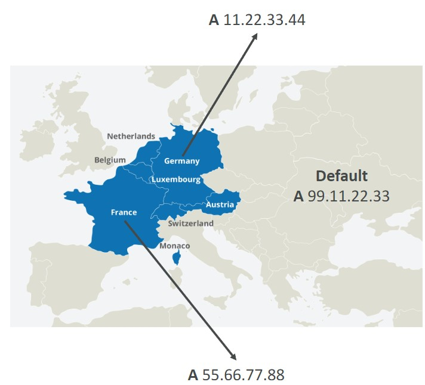
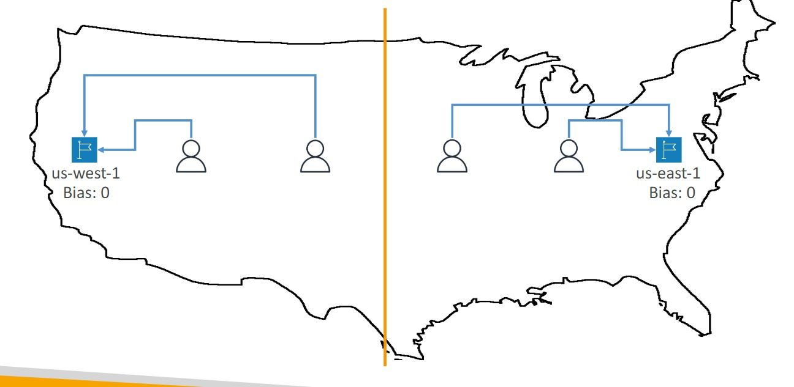

- [DNS](#dns)
- [Records TTL](#records-ttl)
- [CNAME vs Alias](#cname-vs-alias)
- [Routing Policies](#routing-policies)
- [Configuring Amazon Route 53 to route traffic to an S3 Bucket](#configuring-amazon-route-53-to-route-traffic-to-an-s3-bucket)

## DNS
---
- Domain Name System which translates the human friendly hostnames into the machine IP addresses.
- www.google.com =>172.217.18.36
    

## Records TTL
---
- TTL - Time to live 
- High TTL - e.g. 24 hr 
    - less traffic on Route 53
    - Possibly outdated records
- Low TTL - e.g. 60s
    - More traffic on Route 53 ($$)
    - Records are outdated for less time 
    - Easy to change records 

- Except for Alias records, TTL is mandatory for each DNS record
 
## CNAME vs Alias
---
- AWS resources (Load Balancer, CLoudFront..) expose an AWS hostname:
    - lb l-1234.us-east-2.elb.amazonaws.com and you want myapp.mydomain.com
- CNAME:
    - Points a hostname to any other hostname (app.domain.com => blabla.anything.com)
    - <ins>ONLY FOR NON ROOT DOMAIN (aka, something.mydomain.com)
- Alias:
    - Points a hostname to an AWS Resource (app.mydomain.com => blabla.amazonaws.com)
    - <ins>WORKS for ROOT DOMAIN and NON ROOT DOMAIN (aka, mydomain.com)
    - Free of charge 
    - Native health check 
## Routing Policies
---
- <strong>Weighted</strong>
    - <strong><ins>Control the % of the requests that go to each specific resource.</ins></strong>
    - Assign each record a relative weight 
        - $ \text traffic {(\%)} = {\displaystyle \text {weight for a specific record } \over \displaystyle \text {sum of all the weights for all records }} $
        - weights don't need to be sum upto 100
    - DNS records must have the same name and type 
    - Can be associated with Health Checks
    - Use cases: load balancing between regions, testing new application versions  
    
- <Strong>Latency </strong>
    - <ins>Redirect to the resource that has the <strong> least latency </strong>close to us </ins>
    - Super helpful when latency for users is a priority
    - Latency is based on traffic between users and AWS Regions
    - Germany users may be directed to the US (if that's the lowest latency)
    - Can be associated with Health Checks (has a failover capability)
- <strong>Failover</strong>
        
    
- <strong>Geolocation</strong>
    - Different from latency based
    - <strong><i><ins>This routing is based on user location </strong></i></ins>
    - Should <strong>create a "Default" record </strong>(in case there's no match on location)
    - Use cases: website localization, restrict content distribution, load balancing
    - Can be associated with Health Checks 
    
        
- <strong> Geoproximity </strong>
    - <strong><ins>Route traffic to your resources based on the location of users and resources </ins></strong>
    - Ability to <ins>shift more traffic to resources based on the <strong>defined bias</strong></ins>
        
    - To change the size of the geographic region, specify bias values:
        - To expand (1 to 99)- more traffic to the resource 
        - To shrink (-1 to 99)- less traffic to the resource
        
        
    - Resources can be:
        - AWS resources (specify AWS region)
        - Non-AWS resources (specify Latitude and Longitude)
    - You must use Route 53 Traffic Flow to use this feature

## Configuring Amazon Route 53 to route traffic to an S3 Bucket
---
- An S3 bucket that is configured to host a static website
    - You can route traffic for a domain and its subdomains, such as example.com and www.example.com to a single bucket.
    - Choose the bucket that has the same name that you specified for Record name
    - The name of the bucket is the same as the name of the record that you are creating
    - The bucket is configured as a website endpoint
       
