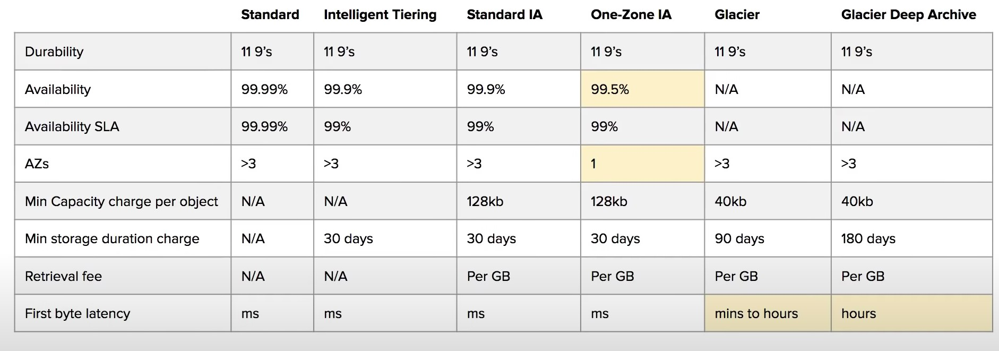
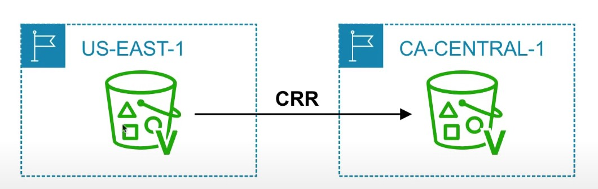
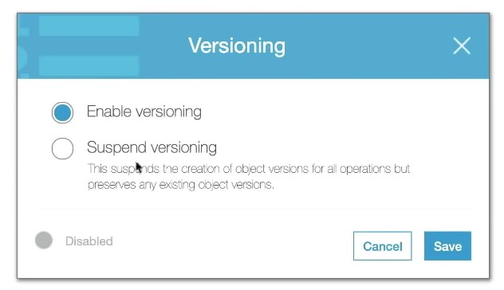

- [Introduction to S3](#introduction-to-s3)
- [S3 Storage Classes](#s3-storage-classes)
- [Storage class comparison](#storage-class-comparison)
- [S3 Security](#s3-security)
- [S3 Encryption](#s3-encryption)
- [S3 Data Consistency](#s3-data-consistency)
- [S3 Cross-Region Replication](#s3-cross-region-replication)
- [S3 Versioning](#s3-versioning)
---
## Introduction to S3
---

- <b> What is Object Storage (Object-based storage)? </b>
- data storage architecture that manages data as objects, as opposed to other storage architectures:
    - file systems: which manages data as files and fire hierarchy
    - block storage- which manages data as blocks within sectors and tracks
        - S3 provides with <u> Unlimited storage </u>
        - Need not think about underlying infrastructure
        - S3 console provides an interface for you to upload and access your data 
        - Individual <u> Object </u> can be store form <u> 0 Bytes to 5 Terabytes </u> in size

| **S3 Object**                                                                   | **S3 Bucket**                                                           |
| ------------------------------------------------------------------------------- | ----------------------------------------------------------------------- |
| - Obejcts contain data(files)                                                   | - Buckets hold objects                                                  |
| - They are like files                                                           | - Buckets can have folders which can turn in hold objects               |
| Object may consists of:    - <b> Key </b> this is the name of the object   - <b> Value </b> data iteself is made up of sequence of bytes    - <b> Version Id </b> version of object (when versioning is enabled)   - <b> Metadata </b> additional information attached to the object                                               | - S3 is universal namespace so domain names must be <u> Unique </u> (like having a domain name)    | 

---
## S3 Storage Classes 
--- 

- AWS offers a range of S3 Storage classes that<u> trade Retrieval, Time, Accessbility and Durability for Cheaper Storage </u>

### (Descending from expensive to cheaper)

- <b> S3 Standard (default) </b>
    - Fast! 99.99 % Availibility, 
    - 11 9's Durability. 
    - Replicated accross at least thress AZs

- <b> S3 Intelleigent Tiering </b>
    - Uses ML to analyze object usage and determine the appropriate storage class
    - Data is moved to most cost-effective tier without any performance impact or added overhead

- <b> S3 Standard-IA (Infrequent Access) </b>
    - Still Fast! Cheaper if you access files less than once a month
    - <u> Additional retrieval fee is applied</u>. 50% less than standard (reduced availability)

- <b> S3 One-Zone-IA </b>
    - Still fast! Objects only exist in one AZ. 
    - Availability (is 99.5%). but cheaper than Standard IA by 20% less 
    - reduces durability
    - Data could be destroyed 
    - Retrieval fee is applied

- <b> S3 Glacier </b>
    - For long term cold storage
    - Retrieval of data can take minutes to hours but the off is <u> very cheap storage </u>

- <b> S3 Glacier Deep Archive </b>
    - The lowest cost storage class
    - Data retrieval time is 12 hours

---
## Storage class comparison
--- 

- S3 Guarantees:
    - Platform is built for 99.99% availability
    - Amazon guarantee 99.99% availability 
    - Amazon guaarantees 11'9s of durability
    
---
## S3 Security
---

- All new buckets are <b> PRIVATE</b> when created by deafult
- Logging per request can be turned on a bucket 
- Log files are genearted and saved in a different bucket (can be stored in a bucket from different AWS account if desired)
- Access control is configured using <b> Bucket Policies </b> and <b> Access Control Lists (ACL) </b>

 
---
## S3 Encryption
---
- <b> Encryption in Transit </b>
    - Traffic between local host and S3 is achieved via <b> SSL/TLS</b>
- <b> Server Side Encryption (SSE) </b> - Encryption at Rest
- Amazon helps to encrypt the object data 
- S3 Managed Keys -(Amazon manages all the keys)
- <b> SSE-AES</b> S3 handles the key, uses AES-256 algorithm
- <b> SSE-KMS</b> Envelope encryption, AWS KMS and you manage the keys 
- <b> SSE-C </b> Customer provided key (you manage the keys)
- <b> Client-Side Encryption </b>
    - You encrypt your own files before uploading them to S3

---
## S3 Data Consistency
---

| New Object (PUTS)  | Overwrite (PUS) or Delete Objects (DELETES) |
| -------------------| --------------------------------------------|
| Read AFter Write Consistency | Eventual Consistency |
| When you upload a new S# Object you are able to read immediatley after writing | When you overwrite or delete an object it takes tim efor S3 to replicate versions to AZs |
| | If you were to read immediately, S3 may return you can old copy. You need to generally wait a few seconds before reading |

---
## S3 Cross-Region Replication
---
- When enabled, any object that is uploaded will be <b> Automatically replicate </b> to another region or from source to destination buckets

- Must have versioning turned on both the source and destination buckets.
- Can have CRR replicate to another AWS account

---
## S3 Versioning
---

- allows to version the object 
- Stores all versions of an object in S3
- 
 Once enabled it cannot be disabled, only suspended on the bucket

     

- Fully integrates with S3 Lifecycle rules
- MFA Delete feature provides extra protection against deletion of your data 

