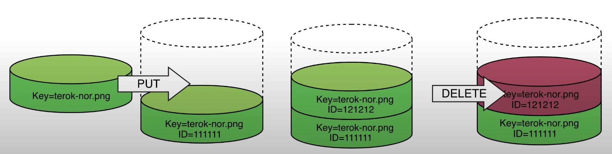
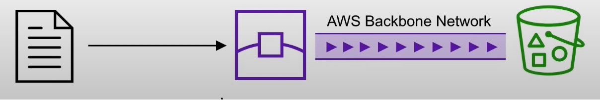
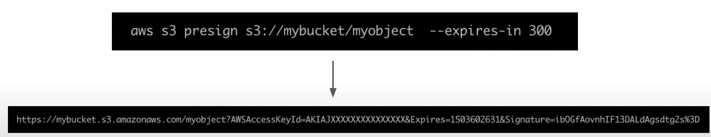
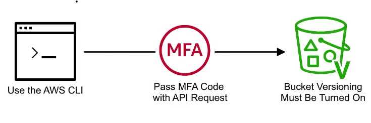
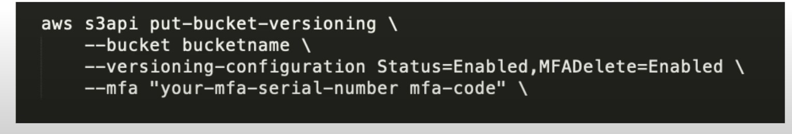

- [Introduction to S3](#introduction-to-s3)
- [S3 Storage Classes](#s3-storage-classes)
- [Storage class comparison](#storage-class-comparison)
- [S3 Security](#s3-security)
- [S3 Encryption](#s3-encryption)
- [S3 Data Consistency](#s3-data-consistency)
- [S3 Cross-Region Replication](#s3-cross-region-replication)
- [S3 Versioning](#s3-versioning)
- [Lifecycle Management](#lifecycle-management)
- [S3 Transfer Acceleration](s3-transfer-acceleration)
- [Presigned URLs](#presigned-urls)
- [MFA Delete](#mfa-delete)
- [AWS Snow Family](#aws-snow-family)
- [Storage Services](#storage-services)
- [Amazon FSx vs EFS](#amazon-fsx-vs-efs)
- [S3 Object Lock](#s3-object-lock)
    - [Governance mode](#governance-mode)
    - [Compliance mode](#compliance-mode)

---
## Introduction to S3
---

- <b> What is Object Storage (Object-based storage)? </b>
- data storage architecture that manages data as objects, as opposed to other storage architectures:
    - file systems: which manages data as files and fire hierarchy
    - block storage- which manages data as blocks within sectors and tracks
        - S3 provides with <u> Unlimited storage </u>
        - Need not think about underlying infrastructure
        - S3 console provides an interface for you to upload and access your data 
        - Individual <u> Object </u> can be store form <u> 0 Bytes to 5 Terabytes </u> in size

| **S3 Object**                                                                   | **S3 Bucket**                                                           |
| ------------------------------------------------------------------------------- | ----------------------------------------------------------------------- |
| - Obejcts contain data(files)                                                   | - Buckets hold objects                                                  |
| - They are like files                                                           | - Buckets can have folders which can turn in hold objects               |
| Object may consists of:    - <b> Key </b> this is the name of the object   - <b> Value </b> data iteself is made up of sequence of bytes    - <b> Version Id </b> version of object (when versioning is enabled)   - <b> Metadata </b> additional information attached to the object                                               | - S3 is universal namespace so domain names must be <u> Unique </u> (like having a domain name)    | 

---
## S3 Storage Classes 
--- 

- AWS offers a range of S3 Storage classes that<u> trade Retrieval, Time, Accessability and Durability for Cheaper Storage </u>

### (Descending from expensive to cheaper)

- <b> S3 Standard (default) </b>
    - Fast! 99.99 % Availability, 
    - 11 9's Durability. 
    - Replicated across at least three AZs

- <b> S3 Intelligent Tiering </b>
    - Uses ML to analyze object usage and determine the appropriate storage class
    - Data is moved to most cost-effective tier without any performance impact or added overhead

- <b> S3 Standard-IA (Infrequent Access) </b>
    - Still Fast! Cheaper if you access files less than once a month
    - <u> Additional retrieval fee is applied</u>. 50% less than standard (reduced availability)

- <b> S3 One-Zone-IA </b>
    - Still fast! Objects only exist in one AZ. 
    - Availability (is 99.5%). but cheaper than Standard IA by 20% less 
    - reduces durability
    - Data could be destroyed 
    - Retrieval fee is applied

- <b> S3 Glacier </b>
    - For long term cold storage
    - Retrieval of data can take minutes to hours but the off is <u> very cheap storage </u>

- <b> S3 Glacier Deep Archive </b>
    - The lowest cost storage class
    - Data retrieval time is 12 hours

---
## Storage class comparison
--- 

- S3 Guarantees:
    - Platform is built for 99.99% availability
    - Amazon guarantee 99.99% availability 
    - Amazon guarantees 11'9s of durability
    
---
## S3 Security
---

- All new buckets are <b> PRIVATE</b> when created by default
- Logging per request can be turned on a bucket 
- Log files are generated and saved in a different bucket (can be stored in a bucket from different AWS account if desired)
- Access control is configured using <b> Bucket Policies </b> and <b> Access Control Lists (ACL) </b>

 
---
## S3 Encryption
---
- <b> Encryption in Transit </b>
    - Traffic between local host and S3 is achieved via <b> SSL/TLS</b>
- <b> Server Side Encryption (SSE) </b> - Encryption at Rest
- Amazon helps to encrypt the object data 
- S3 Managed Keys -(Amazon manages all the keys)
- <b> SSE-AES</b> S3 handles the key, uses AES-256 algorithm
- <b> SSE-KMS</b> Envelope encryption, AWS KMS and you manage the keys 
- <b> SSE-C </b> Customer provided key (you manage the keys)
- <b> Client-Side Encryption </b>
    - You encrypt your own files before uploading them to S3

---
## S3 Data Consistency
---

| New Object (PUTS)  | Overwrite (PUS) or Delete Objects (DELETES) |
| -------------------| --------------------------------------------|
| Read After Write Consistency | Eventual Consistency |
| When you upload a new S3 Object you are able to read immediately after writing | When you overwrite or delete an object it takes time for S3 to replicate versions to AZs |
| | If you were to read immediately, S3 may return you an old copy. You need to generally wait a few seconds before reading |

---
## S3 Cross-Region Replication
---
- When enabled, any object that is uploaded will be <b> Automatically replicate </b> to another region or from source to destination buckets

    

- Must have versioning turned on both the source and destination buckets.
- Can have CRR replicate to another AWS account

---
## S3 Versioning
---

- allows to version the object 
- Stores all versions of an object in S3
- 
 Once enabled it cannot be disabled, only suspended on the bucket

     

- Fully integrates with S3 Lifecycle rules
- MFA Delete feature provides extra protection against deletion of your data 

    

--- 
## Lifecycle Management
---

- Automates the process of moving objects to different Storage classes or deleting objects all together 
- Can be used together with <b> Versioning </b>
- Can be applied to both <b> Current </b> and <b> previous </b> versions 

    

---
## S3 Transfer Acceleration 
---

- Fast and secure transfer of files<b>  over long distances </b> between your end users and an S3 bucket
- Utilizes <b> <u> CloudFront's </u></b> distributed <b><u> Edge locations </u></b>
- Instead of uploading to your bucket, users use a <i><u> distinct URL </u></i> for an Edge location
- As data arrives at the Edge location it is automatically routed to S3 over a specially optimized network path. (Amazon's backbone network)

    

--- 
## Presigned URLs
---
- Generates a URL which provides temporary access to an object to either upload or download object data.
- Presigned Urls are commonly used to <u> provide access to <b> private objects </b></u>
- Can use AWS CLI or AWS SDK to generate Presigned Urls

    

- If in case a web-application which need to allow users to download files from a password protected part of the web-app. Then the web-app generates presigned url which expires after 5 seconds. The user downloads the file.

---
## MFA Delete
---
- <b> MFA Delete</b>  ensures users cannot delete objects from a bucket unless they provide their MFA code.

    

- MFA delete can only be enabled under these conditions
    1. The AWS CLI must be used to turn on MFA 
    2. The bucket must have versioning turned on

    

- Only the bucket owner logged in as <u><b> Root User</b></u> can <b> DELETE</b> objects from bucket

---
## AWS Snow Family
---

- AWS Snow Family are <u> Storage and compute devices used to physically move data in or out the cloud </u> when moving data over the internet or private connection it to slow, difficult or costly

 

---
 ## Storage Services 
 ---

- <b> Simple Storage Service (S3)</b>
    - A <u> serverless object storage service </u> is created   
    - can upload very large files and unlimited amount of files 
    - you pay for what you store
    - Need not worry about the underlying file-system or upgrading the disk size

- <b> S3 Glacier </b>
    - Cold storage service
    - <u> low cost storage solution </u> for <i> archiving and long-term backup </i>
    - Uses previous generation HDD drives to get that low cost
    - highly secure and durable

- <b> Elastic Block Store (EBS) </b>
    - <u> a persistent block storage service </u>
    - virtual hard drive in the cloud to attach to EC2 instances 
    - can choose different kinds of storage: SSD, IOPS, SSD, Throughput HHD, Cold HHD

- <b> Elastic File Storage (EFS) </b>
    - <u> a cloud-native NFS file system service </u>
    - File storage you can mount to <u> multiple Ec2 instances at the same time</u>
    - When you need to share files between multiple EC2 instances

- <b> Storage Gateway </b>
    - <u> a hybrid cloud storage </u> service that extends your on-premise storage to cloud
        - <b> File Gateway </b> : extends your local storage to AWS S3
        - <b> Volume Gateway </b> : caches your local drives to S3 so you have continuous backup of files on cloud
        - <b> Tape Gateway </b> : stores files on virtual tapes for very cost effective and long term storage
     
- <b> AWS Snow Family </b>
    - Storage devices used to physically migrate large amounts of data
    - <b> Snowball  and Snowball Edge </b> {Snowball does not exist anymore} briefcase size of data storage devices. 50-80 Terabytes
    - <b> Snowmobile </b> Cargo container filled with racks of storage and compute that is transported via semi-trailer tractor truck to transfer upto 100PB of data per trailer
    - <b> Snowcone </b> very small version of snowball that can transfer 8TB of data

- <b> AWS Backup </b>
    - a <u> fully managed backup service </u>
    - centralize and automate the backup of the backup data across multiple AWS services 
    - eg. EC2, EBS, RDS, DynamoDB, EFS, Storage Gateway
    - can create backup plans

- <b> Cloud Endure Disaster Recovery </b>
    - Continuously replicates your machines into low cost staging area in your target AWS account and preferred region enabling fast and reliable recovery if one of the data center fails

- <b> Amazon FSx </b>
    - <u>a feature rich and highly-performant file system</u>
    - Can be used for Windows (SMB) or Linux (Lustre)
        - <b> Amazon Fsx for Window File Server </b> uses the SMB protocol to and allows you to mount FSx to windows servers
        - <b> Amazon FSx for Lustre </b> uses Linux's Lustre file systems and allows you to mount FSx to Linux servers 

- <b> Amazon Athena </b>
    - A serverless, interactive analytics service built on open-source frameworks, <u> <b>supporting open-table and file formats.</u></b>
    - Athena provides simplified flexible way to analyze petabytes of data where it lives
    - Analyze data or build applications from an S3 data lake and 30 data sources, including on-premises data sources or other cloud systems using SQL or Python

## Amazon Fsx vs EFS
---

| EFS | FSx |
| --- | --- |
|EFS is a managed NAS filer for EC2 instances based on Network File System (NFS) version 4 | FSx is a managed Windows Server that runs Windows Server Message Block (SMB) based files systems |
| File systems are distributed across availability zones (AZs) to eliminate I/O bottlenecks and improve data durability | Built for high performance  and  sub-millisecond latency using solid-state drive storage volumes |
| Better for Linux Systems | Applications:   - Web servers and content management systems built on windows and deeply integrated with windows server ecosystem | 

## S3 Object Lock 
---
- With S3 Object Lock, you can store objects using <u> <b> write-once-read-many (WORM) </u></b> mode.
- Object lock can <u> prevent from objects from being deleted or overwritten </u> for a <i> fixed amount of time or indefinitely </i>

### Governance mode 
- Users can't overwrite or delete an object version or alter its lock settings unless they have special permissions.
- Protect objects against being deleted by most users, but you can still grant some users permission to alter the retention settings or delete the object if necessary.
- Used to test retention-period settings before creating a compliance- mode retention period

### Compliance mode 
---
- A protected object version can't be overwritten or deleted by any user, including the root user 
- When an object is locked in compliance mode, its retention mode can't be changed, and tis retention period can't be shortened.
- Compliance mode helps ensure that an object version can't be overwritten or deleted for the duration of the retention period

