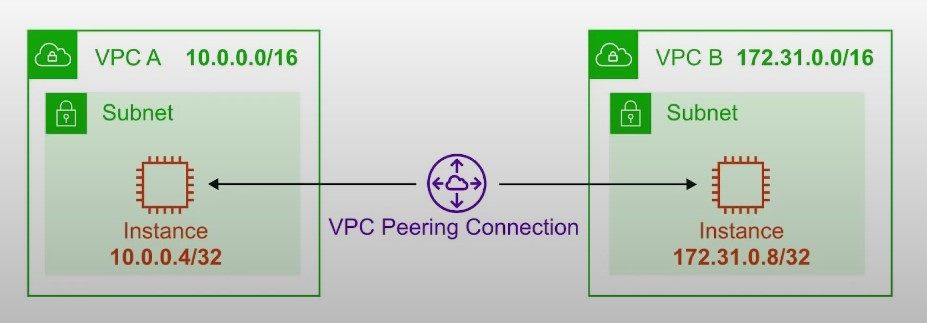
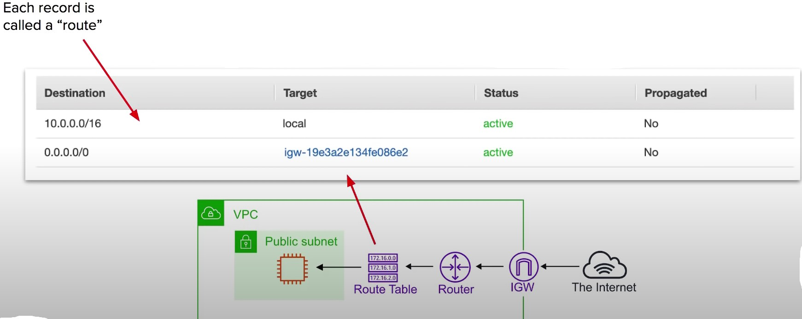
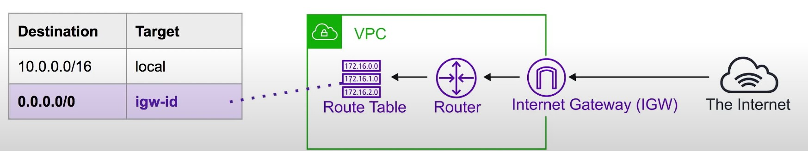
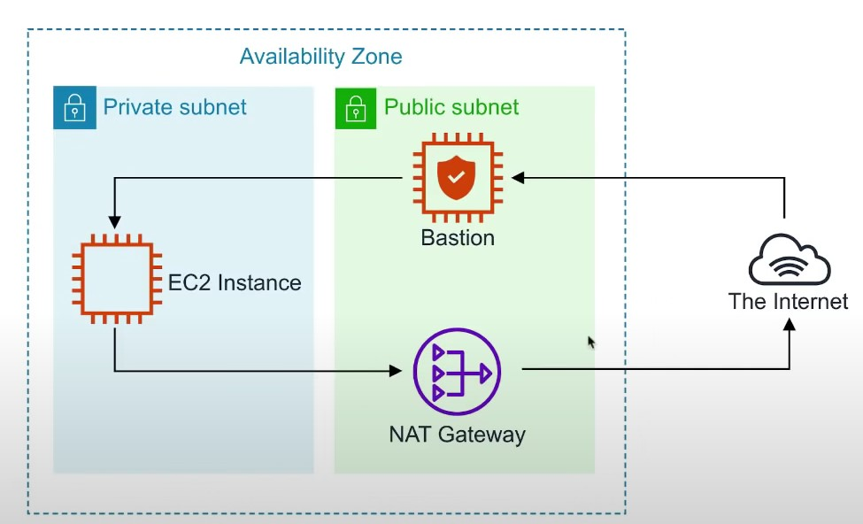
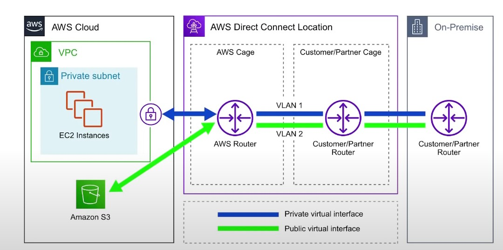
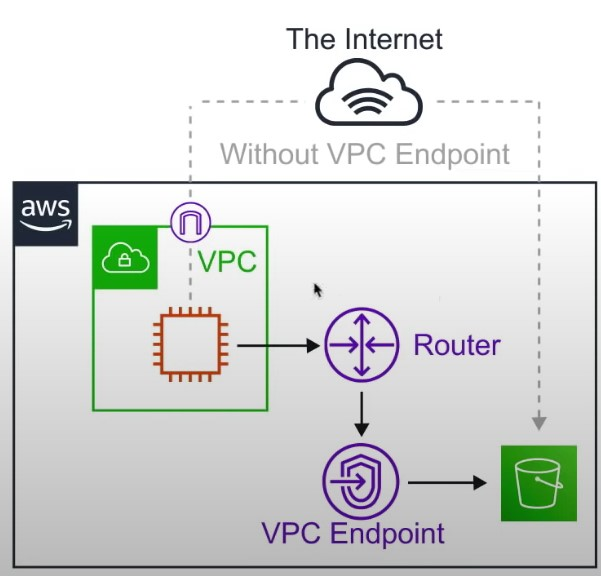

- [Introduction to VPC](#introduction-to-vpc)
- [Core Components](#core-components)
- [Key Features](#key-features)
- [Deafult VPC](#default-vpc)
- [VPC Peering](#vpc-peering)
- [Route Tables](#route-tables)
- [Internet Gateway](#internet-gateway)
- [Bastion / Jumpbox](#bastion-jumpbox)
- [Direct Connect](#direct-connect)
- [VPC Endpoints](#vpc-endpoints)
    - [Interface Endpoints](#interface-endpoints)
    - [VPC Gateway Endpoints](#vpc-gateway-endpoints)
- [VPC Flow Logs](#vpc-flow-logs)
- [NACLs](#nacls)

---
## Introduction to VPC
---
- Think of a AWS VPC as your own personal data centre
- Gives you complete control over your virtual networking environment.

---
## Core Components
---
- Internet Gateway (IGW)
- Virtual Private Gateway (VPN Gateway)
- Routing Tables 
- Network Access Control Lists (NACLs) - Stateless
- Security Groups (SG) Stateful
- Public Subnets
- Private Subnets 
- Nat Gateway
- Customer Gateway
- VPC Endpoints
- VPC Peering

---
## Key Features
---
- VPCs are Region Specific they do not span regions 
- You can create 5 VPC per region
- Every region comes with a default VPC
- You can have 200 subnets per VPC
- You can use IPv4 Cidr Blocks (the address of the VPC)
- Cost nothing: VPC's, Route Tables, Nacls, Internet Gateways, Security Groups and Subnets, VPC Peering
- Some things cost money: eg. NAT Gateway, VPC Endpoints, VPN Gateway, Cutomer Gateway
- DNS hostnames (should your instance have domain)

---
## Default VPC
---
- Craete a VPC with a szie/16 IPv4 CIDR block (172.31.0.0./16)
- Create a size /20 default subnet in each AZ
- Create an Internet Gateway and connect it to your default VPC 
- Create a default security  group and associate it with your default VPC 
- Create a default network access control list (NACL) and associate it with your default VPC
- Associate the default DHCP options set for your AWS account with your default VPC
- when you create a VPC, it automatically has a main route table

---
## VPC Peering
---
- VPC  Peering allows to connect one VPC with another over a direct network route using private IP addresses
- Instances on peered VPCs <b> behave </b> just like they are on the <b>same network</b>
- Connect VPCs across <b>same</b> or <b> different AWS accounts </b> and <b> regions </b>
- Peering uses a <u> <b> Star Configuration: 1 Central VPC - 4 other VPCs</b></u>
- <b> No Transitive Peering </b> (peering must take place directly between VPCs)
    - Needs a one to one connect to immediate VPC
- <b> No Overlapping CIDR Blocks </b>

    

---
## Route Tables 
---
- Route Tables are used to determine where network traffic is directed 
- Each subnet in your VPC must be associated with a route table
- A subnet can only be associated with one route table at a time, but you can associate multiple subnets with the same route table

    

---
## Internet Gateway (IGW)
---
- The Internet Gateway allows your VPC access ot the Internet 
- IGW does two things:
    1. Provide a target in your VPC route tables for internet-routable traffic 
    2. Perform network address translation (NAT) for instances that have been assigned public IPv4 addresses

- To route out to the internet you need to add in your route tables you need to add a route 
- To the internet gateway and set the Destination to be 0.0.0.0/0

    

---
## Bastion / Jumpbox
---
- Bastions are EC2 instances which are security harden.
- They are designed to help you gain access to your EC2 instances via SSH or RCP that are in a <b> <u> private subent</u> </b>
- They are also known as Jump boxes because you are jumping from one box to access another.
- NAT Gateways/Instances are only intended for EC2 instances to gain outbound access to the internet for things such as security updates .
- NATs cannot/should not be used as Bastions 
- System Manager's <b> Sessions Manager </b> replaces the need for Bastions
    

---
## Direct Connect 
---
- AWS Direct Connect is the AWS Solution for establishing dedicated netwrok connections from on-premises locations to AWS
- Very fast network lower Bandwidth 50M-500M or Higher bandwidth 1GB or 10GB

- Helps reduce network costs and increase bandwidth throughput (great for high traffic networks)
- Provides a more consistent network experience than a typical internet based connection(reliable and secure)

    

---
## VPC Endpoints
---
- { <b> Think of a secret tunnel where you don't have tp leave the AWS network</b>}
- VPC Endpoints allow you to privately connect your VPC to toher AWS services, and VPC endpoint services 
- There are two types of VPC Endpoints
    1. Interface endpoints
    2. Gateway Endpoints
- Eliminates the need for an <b> <u>Internet Gateway, NAT device, VPN connection or AWS Direct Connect </u></b> connections 
- Instances in the VPC <u> do not require a public IP address </u> to communicate with service resources
- Traffic between your VPC and other services <u> does not leave the AWS network</u>
- <b> Horizontally scaled,redundant and highly available </b> VPC component
- Allows secure communication between instances and services <b> without adding avilability risks or bandwidth constraints </b> on your traffic
    
    

---
## Interface Endpoints
---
- Interface Endpoints are ELastic Network Interfaces (ENI) with a private IP address. They serve as an entry point for traffic going to a supported service 
    - Interface Endpoints are powered by AWS PrivateLink
    - Access services hosted on AWS easily and securely by keeping your network traffic within the AWS network
        - ~$7.5/mo
            -  Pricing per VPC endpoint per AZ ($/hour) 0.01
            - Pricing per GB data proccessed ($) 0.01 
- Interface Endpoints support the following AWS services 
    - API GATeway
    - CloudFormation
    - CloudWatch
    - Kinesis 
    - SageMaker
    - CodeBuild
    - AWS COnfig 
    - EC2 API 
    - ELB API
    - AWS KMS
    - Secrets Manager
    - Security Token Service
    - Service Catalog
    - SNS
    -SQS
    - Systems Manager
    - Marketplace Partner Services 
    - Endpoint Services in other AWS accounts

---
## VPC Gateway Endpoints
---
- A Gateway Endpoint is a gateway that is a target for a specific route in your route table, used for traffic destined for a supported AWS service.
- To create a Gateway Endpoint, you must specify the VPC in which you want to create the endpoint, and the service to which you want to establish the connection
- AWS Gateway Endpoint currently supports 2 services 
    - AMazon S3
    - DynamoDB

---
## VPC Flow Logs 
---
- <b> VPC FLow Logs </b> allow you to capture <b> IP Traffic information </b> in-and-out of Network Interfaces withinn your VPC
- Network Interfaces within your VPC 
- Flow Logs can be created for 
    1. VPC
    2. Subnets 
    3. Network Interface 
- All log data is stored using Amazon <b> Cloudwatch Logs </b>
- After a Flow Log is created it can be viewed in details within CloudWatch Logs 

- [version][account-id][interface-id][srcaddr][dstaddr][srcport][destport][protocol][packets][bytes][start][end][action][log-status]
- 2 123456789010 eni-abc123de 172.31.16.139 172.31.16.21 20641 22 6 20 4249 1418530010 1418530070 ACCEPT OK
    - <b> Version </b> The VPC flow logs version 
    - <b> account- id </b> The AWS account ID for the flow log 
    - <b> interface-id </b> The ID of the network interface for which the traffic is recorded 
    - <b> srcaddr </b> The source IPv4 or Ipv6 address. The IPv4 address of the netwrok interface is always its private Ipv4 address 
    - <b> dstaddr </b> The destination IPv4 or Ipv6 address. The IPv4 address of the netwrok interface is always its private IPv4 address
    - <b> srcport </b> The source port of the traffic
    - <b> dstport </b> The destination port of the traffic 
    - <b> protocol </b> The IANA protocol number of the traffic. For more information, see assigned Internet  Protocol Numbers.
    - <b> Packets </b> The number of packets transferred during the capture window
    - <b> Bytes </b> The number of bytes transferred during the capture window
    - <b> start </b> The time, in Unix Seconds of the start of the capture window
    - <b> end </b> The time, in Unix seconds, of the end of the capture window
    - <b> action </b> The action associated with the traffic
        - ACCEPT: The recorded traffic was permitted by the security groups or network ACls
        - REJECT: The recorded traffic was not permitted by the security groups or network ACls
    - <b> log-status </b> The logging status of the flow log
        - OK: Data is logging normally to the chosen destinations
        - NODATA: There was no network traffic to or from the network interface during the capture window
        - SKIPDATA: SOme flow log records were skipped during the capture window. This may be because of an internal capacity constraint or an internal error

---
## NACLs
---
- Network Access COntrol List (NACLs)
- An (optional) layer of Security that acts as a firewall for controlling traffic in and out of subnet(s).
- NACLs acts as a virtual firewall at the subnet level
- VPCs automatically get a default NACL
- Subnets are associated with NACLs. Subnets can only belong to a single NACL
- Each NACL contains a set of rules that can allow or deny traffic into (inbound) and out of (outbound)
- Rule # determines the order of evaluation. From lowest to highest. The highest rule # can be 32766 and its recommended to work in 10 or 100 increments.
- You can allow or deny traffic. You could block a single IP address (You can't do this without Security Groups)
- <b> Use Case </b>
    - We determine there is a malicious actor at a specific IP address is trying to access our instances so we block their IP
    - We never need to SSH into instances so we add a DENY for these subnets. This is just an additional measure in case our security groups SSH port was left open .

