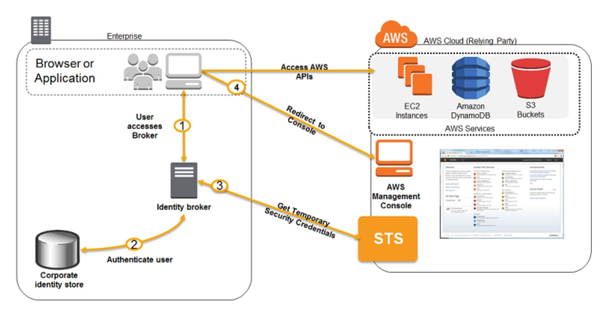
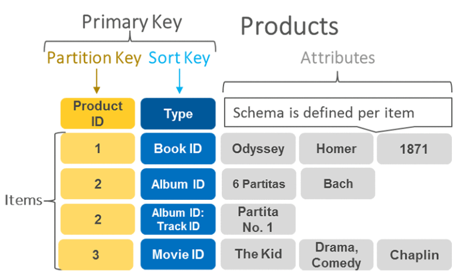
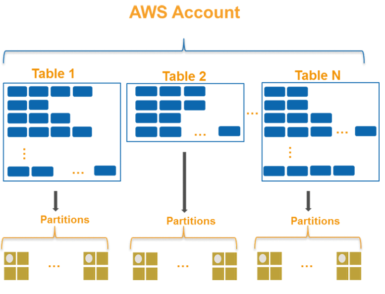
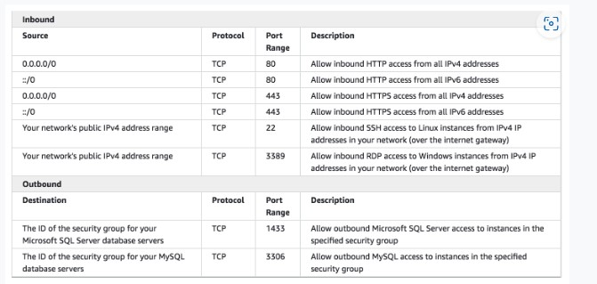
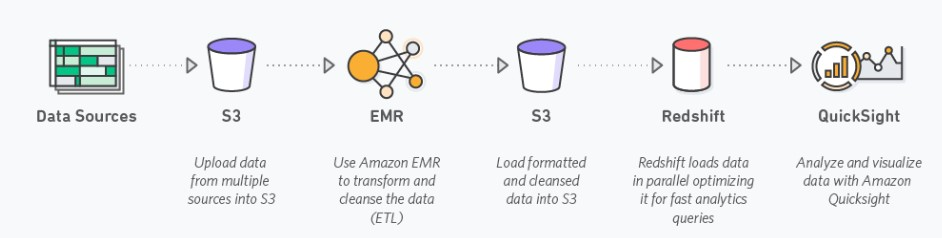
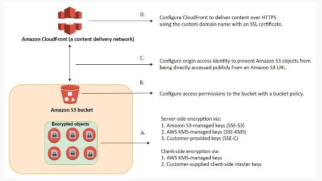
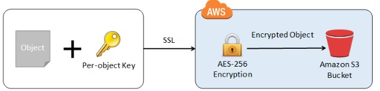
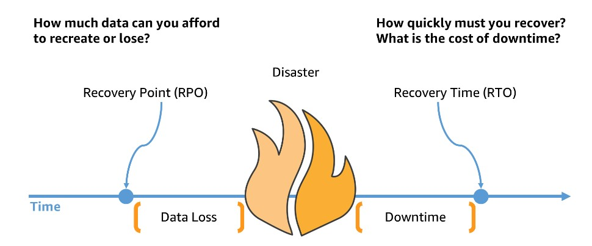
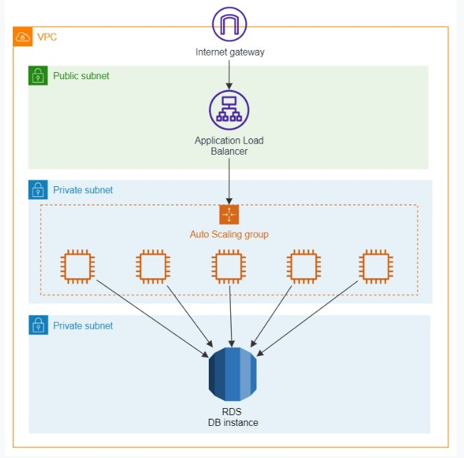

## Table of Contents
- [Amazon EBS](#amazon-ebs)
- [Cloudwatch](#cloudwatch)
- [AWS Identity and Access Management](#aws-identity-and-access-management)
- [RDS](#rds)
- [Athena](#athena)
- [Kinesis](#kinesis)
- [DynamoDB](#dynamodb)
- [Storage Gateway](#storage-gateway)
- [Elastic Load Balancer](#elastic-load-balancer)
- [Security Group](#security-group)
- [Route 53](#route-53)
- [AWS Transit Gateway](#aws-transit-gateway)
- [Amazon EMR](#amazon-emr)
- [Auto Scaling](#auto-scaling)
- [S3](#s3)
- [Cloudfront](#cloudfront)
- [Secrets Manager](#secrets-manager)
- [Textract](#textract)
- [RPO and RTO](#rpo-and-rto)
- [EC2](#ec2)
- [Network Firewall](#network-firewall)
- [Security](#security)

## Amazon EBS
---

- <b> Amazon EBS </b> provides three volume types to best meet the needs of your workloads: 
    - <b> General Purpose (SSD) </b>
        - General Purpose (SSD) volumes are suitable for a <ins>broad range of workloads, including small to medium-sized databases, development and test environments, and boot volumes.</ins>
    - <b> Provisioned IOPS (SSD) </b>
        - These volumes offer storage with consistent and low-latency performance and are designed for I/O intensive applications such as <ins>large relational or NoSQL databases. </ins>
    - <b>Magnetic</b>
        - for workloads where <ins>data are accessed infrequently, and applications where the <i>lowest storage cost</i> is important. </ins>
- Here is a list of important information about EBS Volumes:

    - When you create an EBS volume in an Availability Zone, it is automatically replicated within that zone to prevent data loss due to a failure of any single hardware component.

    - An EBS volume can only be attached to one EC2 instance at a time.

    - After you create a volume, you can attach it to any EC2 instance in the same Availability Zone

    - An EBS volume is off-instance storage that can persist independently from the life of an instance. You can specify not to terminate the EBS volume when you terminate the EC2 instance during instance creation.

    - EBS volumes support live configuration changes while in production which means that you can modify the volume type, volume size, and IOPS capacity without service interruptions.

    - Amazon EBS encryption uses 256-bit Advanced Encryption Standard algorithms (AES-256)

    - EBS Volumes offer 99.999% SLA. This

## Cloudwatch
---
- Monitoring tool for your AWS resources and applications.
- <ins> Display metrics and create alarms </ins> that watch the metrics and send notifications or automatically make changes to the resources you are monitoring when a threshold is breached.

## AWS Identity and Access Management
---
- You should <ins> <i><strong>always associate IAM role to EC2 instances not IAM user for the purpose of accessing other AWS services </ins> </i></strong>
- <strong> IAM roles </strong> are designed so that your <ins>application can <i>securely make API requests</i> from your instances,</ins> without requiring you to manage the security credentials that the application use.
    - Instead of creating and distributing your AWS credentials, you can <ins>delegate permission to make API requests using <strong>IAM roles</strong></ins>
- <strong>AWS Organization</strong> is a service that allows you to manage multiple AWS accounts easily.
 - <strong>AWS IAM Identity Center </strong> can be integrated with your corporate directory service for centralized authentication. 
    - This means you can <ins>sign in to multiple AWS accounts with just one set of credentials.</ins> 
    - This integration helps to streamline the authentication process and makes it <ins>easier for companies to switch between accounts.</ins>
- <strong>SCP</strong> you can also configure a <ins>service control policy (SCP) </ins>to manage your AWS accounts.
    - SCPs help you <ins> enforce policies across your organization and control the services </ins> and features accessible to your other account.
    - prevents unauthorized access

- <strong>Security Token Service (STS)</strong> is the service that you can use to <ins>create and provide trusted users with temporary security credentials</ins> that can control access to your AWS resources. 
    - <ins>Temporary security credentials work almost identically to the long-term access key credentials</ins> that your IAM users can use.
- <strong> AWS Control Tower </strong> provides a single location to easily <ins> set up your new well-architected multi-account environment </ins> and govern your AWS workloads with rules for security,operations, and internal compliance. 
    - You can automate the setup of your AWS environment with best-practices <ins>blueprints for multi-account structure, identity, access management, and account provisioning workflow. </ins>
    - <ins> offers "guardrails" </ins> for ongoing governance of your AWS environment.
- You can use an <i><ins>IAM role to specify permissions for users </ins></i> whose identity is federated from your organization or a third-party identity provider (IdP).
    - <b>Federating users with SAML 2.0</b>
        - If your organization already uses an identity provider <ins>software package that supports SAML 2.0 (Security Assertion Markup Language 2.0)</ins>, you can create trust between your organization as an identity provider (IdP) and AWS as the service provider. 
        - You can then use SAML to provide your users with <ins>federated single-sign on (SSO) </ins>to the AWS Management Console or federated access to call AWS API operations. 
        - <b>For example</b>: if your company uses Microsoft Active Directory and Active Directory Federation Services, then you can federate using SAML 2.0
    - <b>Federating users by creating a custom identity <ins>broker application</ins></b>
        - If your <ins>identity store is not compatible with SAML 2.0,</ins> then you can <i>build a custom <b>identity broker application </b> to perform a similar function. </i>
        - The broker application <ins>authenticates users, requests temporary credentials for users from AWS,</ins> and then provides them to the user to access AWS resources.
        - The application verifies that employees are signed into the existing corporate network's identity and authentication system, which might use LDAP, Active Directory, or another system. The identity broker application then obtains temporary security credentials for the employees.
        - To <i>get temporary security credentials, </i>the identity broker application calls either `AssumeRole` or `GetFederationToken` to obtain temporary security credentials, depending on how you want to manage the policies for users and when the temporary credentials should expire.
        - The <ins>call returns temporary security credentials consisting of an AWS access key ID, a secret access key, and a session token.</ins> The identity broker application makes these temporary security credentials available to the internal company application. 

            
        - This scenario has the following attributes:

            - The identity broker application has permissions to access IAM's token service (STS) API to create temporary security credentials.

            - The identity broker application is able to verify that employees are authenticated within the existing authentication system.

            - Users are able to get a temporary URL that gives them access to the AWS Management Console (which is referred to as single sign-on).

## RDS
---
- Supports <b>Aurora, MySQL, MariaDB, PostgreSQL, Oracle, Microsoft SQL Server.</b>
- <b>DB Instance </b>
    - For production OLTP use cases, use <b>Multi-AZ deployments </b> for <ins>enhanced fault tolerance with Provisioned <i>IOPS</ins> </i>storage for fast and predictable performance.
        - You can use PIOPS storage with Read Replicas for MySQL, MariaDB or PostgreSQL.
    - <b> Magnetic </b>
        - Doesn’t allow you to scale storage when using the SQL Server database engine.
            - Doesn’t support elastic volumes.
            - Limited to a maximum size of 3 TiB.
            - Limited to a maximum of 1,000 IOPS.
- RDS automatically performs a failover in the event of any of the following:
    1. Loss of availability in primary Availability Zone.
    2. Loss of network connectivity to primary.
    3. Compute unit failure on primary.
    4. Storage failure on primary.

## Athena
---
- An interactive query service that makes it easy to analyze data directly in Amazon S3 and other data sources using SQL.
- <i>Serverless</i>
- Has a <ins>built-in query editor.</ins>
- highly available and durable
-  <ins>integrates with <b>Amazon QuickSight </b></ins> for easy data visualization.
- retains query history for 45 days.
- You pay only for the queries that you run. You are charged based on the amount of data scanned by each query.
- There are 2 types of cost controls:
    - <b> Per-query limit </b> 
        - specifies a threshold for the total amount of data scanned per query. 
        - Any query running in a workgroup is <ins>canceled once it exceeds the specified limit</ins>. 
        - Only one per-query limit can be created
    - <b>Per-workgroup limit</b> 
        - this limits the total amount of data scanned by all queries running within a specific time frame. 

## Kinesis
---
- A fully managed AWS service that you can use to stream <ins> live video from devices to the AWS Cloud</ins>, or build applications for <strong> real-time video processing or batch-oriented video analytics.</strong>
- Amazon Kinesis Data Streams enables real-time processing of streaming big data. It provides ordering of records, as well as the ability to read and/or replay records in the same order to multiple Amazon Kinesis Applications
- A Kinesis data stream is a set of <ins>shards that has a sequence of data records </ins>, and each data record has a <strong>sequence number </strong>that is assigned by Kinesis Data Streams. 
    - Kinesis <ins>can also easily handle the high volume of messages</ins> being sent to the service.
    - durable
    - no missing of messages

## DynamoDB
- ### How to choose the right partition key ?
    - What is partition key ?
        - DynamoDB supports 2 types of primary keys 
            - Partition key: <ins> A simple primary key,</ins> composed of one attribute known as the partition key.
            - Partition key and Sort key: Referred to as Composite Primary Key, this type of key is composed of two attributes. 1st one is partition key and 2nd one is sort key
        
    - Why do I need a partition key?
        - DynamoDb stores data as groups of attributes, - Items 
        - Items are similar to rows or records in other database systems. 
        - DynamoDB stores and retrieves each item based on the primary key value which must be unique
        - <ins><strong><i>DynamoDb uses the partition key's value as an input to an internal hash function. </i></ins></strong> The output from the hash function determines the partition in which the item is stored. Each item's location is determined by the hash value of its partition key.
        
    - DynamoDB automatically supports access patterns using the throughput you have provisioned, or upto your account limits in the on-demand mode
    - Regardless of the capacity mode you choose <ins><strong><i> if your access pattern exceeds 3000 RCU and 1000 WCU for a single partition key value, your requests might be throttled with a  `ProvisionedThroughputExceededException` error </ins></strong></i>
    - Recommended for Partition keys :
        - <ins> Use high-cardinality attributes. </ins> These are attributes that have distinct values for each item, like `emailid`, `employee_no`, `customerid`, `sessionid`, `orderid`
        - <ins><strong>Use composite attributes </ins></strong> Try to combine more tha one attribute to form a unique key, if that meets your access pattern
        - <strong><ins>Cache the popular items</ins></strong> when there is high volume of read traffic using DAX (DynamoDB Accelerator)
        - DAX is fully managed, in-memory cache for DynamoDB that doesn't require developers to manage cache invalidation, data population or cluster management.
        - DAX also is compatible with DynamoDB API calls, so developer can incorporate it more easily into existing applications
## Storage Gateway
---

- Connects an on-premise software appliance with cloud-based storage to <ins>provide seamless integration with data security features between your <b>on-premises IT environment and the AWS storage infrastructure.</b></ins>
- You can use the service to store data in the AWS cloud for scalable and cost-effective storage that helps maintain
- It stores files as native S3 objects, archives virtual tapes in Amazon Glacier and stores EBS snapshots generated by the Volume Gateway with Amazon EBS.

    

## Elastic Load Balancer 
---
- Distributes incoming application or network traffic across multiple targets, such as EC2 instances containers (ECS), Lambda functions and IP addresses in multiple Availability zones

## Security Group
---

- A security group acts as a virtual firewall for your instance to control inbound and outbound traffic.
     
     

## Route 53
---

- A highly available and scalable Domain Name System (DNS) web service used for domain registration, DNS routing and health checking

## AWS Transit Gateway
---

- A networking service that uses a hub and spoke model to connect the on-premises data centers and Amazon VPCs to a <ins><em>Single Gateway.</em></ins>
- With this service, customers only have to create and manage  <ins><em><strong>a single connection from the central gateway into each on-premises data center</ins></em></strong>
- <strong>Features</strong>:
    - <strong>Inter-region peering </strong>
        - allows customers to route traffic
        - easy and cost-effective way
    - <strong> Multicast </strong>
        - allows customers to have fine-grain control on who can consume and produce multicast traffic
    - <strong>Automated provisioning </strong>
        - customers can automatically identify the Site-to-site VPN connections and on-premises resources with which they are associated using AWS Transit Gateway

## Amazon EMR
---
- EMR (Elastic MapReduce)
- A managed cluster that <ins>simplifies running big data frameworks </ins>like Apache Hadoop and Apache Spark on AWS to process and analyze vast amounts of data.
- You can process data for analytics purposes and <ins>business intelligence workloads </ins>using EMR together with Apache Hive and Apache Pig
- You can <ins><em>use EMR to move large amounts of data in and out of other AWS data stores </em></ins> and databases like S3 and DynamoDB

    
- Purchasing options:
    - On-Demand:reliable, predictable, won't be terminated 
    - Reserved (min 1 year): cost savings (EMR will automatically use if available)

## Auto Scaling 
---
- Configure automatic scaling for the AWS resources quickly through a scaling plan that uses <strong> Dynamic Scaling </strong>and <strong>Predictive scaling </strong>.
- <strong><em>Useful for </em></strong>:
    - Cyclical traffic such as high use of resources during regular business hours and low use of resources
    - On and Off traffic such as <ins>batch processing, testing and periodic analysis </ins> 
    - Variable traffic patterns, such as software for <ins>marketing growth with periods of spiky growth </ins>
- <Strong>Dynamic Scaling</strong>
    - To add and remove capacity for resources to maintain resource at target value
- <Strong>Predictive Scaling</strong>
    - To forecast the future load demands by analyzing your historical records for a metric 
    - <ins>Allows schedule scaling </ins> by adding or removing capacity and controls maximum capacity
    - <ins><em> <strong>Only available for EC2 scaling groups </ins></em></strong>
- In Auto Scaling, the following statements are correct regarding the cooldown period:
    - It ensures that the Auto Scaling group does not launch or terminate additional EC2 instances before the previous scaling activity takes effect.
    - Its default value is 300 seconds.
    - It is a configurable setting for your Auto Scaling group.

## S3
---
- <strong>Server-side encryption (SSE)</strong> is about data encryption at rest-that is, Amazon S3 encrypts your data at the object level as it writes it to disks in its data centers and decrypts it for you when you access it.
    
    - You have three mutually exclusive options depending on how you choose to manage the encryption keys:

        1.<strong>Amazon S3-Managed Keys (SSE-S3) </strong>

        2. <strong>AWS KMS-Managed Keys (SSE-KMS)</strong>

        3. <strong>Customer-Provided Keys (SSE-C)</strong>
    - <strong> S3-Managed Encryption Keys (SSE-S3)</strong>
        - Amazon S3 will <ins>encrypt each object with a unique key</ins> and as an additional safeguard,<ins> it encrypts the key itself with a master key that it<strong> rotates regularly. </strong></ins>
    - <strong> SSE-AES </strong> S3 handles the key, uses AES-256 algorithm 
        - one of the strongest block ciphers available, 256-bit Advanced Encryption Standard (AES-256), to encrypt your data.
        
- <strong>Client-side Encryption </strong>using
    1. AWS KMS-managed customer master key
    2. client-side master key
- <strong>Cross-Account Access</strong>
You can provide another AWS account access to an object that is stored in an S3 bucket. 
    - These are the methods on how to grant cross-account access to objects that are stored in your own Amazon S3 bucket:
        - <strong>Resource-based policies and IAM policies </strong> 
        - <strong>Resource-based Access Control List (ACL) and IAM policies </strong>

    - Cross-account IAM roles for programmatic and console access to S3 bucket objects
    - <ins> Supports failover controls for S3 Multi-Region access points.</ins>
- <strong>Requester Pays Buckets </strong> 
    - Bucket owners pay for all of the Amazon S3 storage and data transfer costs associated with their bucket.

## CloudFront
---

## Secrets Manager 
---

- Helps to <ins> <i> manage, retrieve and <strong>rotate database credentials,</strong> application credentials, OAuth tokens, API keys and other secrets throughout their lifecycles 
</ins></i>
- Helps to <ins> improve security posture </ins>, because you <ins><strong>no longer need hard-coded credentials</strong> </ins> in application source code.
    - Storing the credentials in Secrets Manager helps avoid possible compromise by anyone who can inspect the application or the components. 
    - Replace hard-coded credentials with a runtime call to the Secrets Manager service to retrieve credentials with a runtime call to the Secrets Manager service to retrieve credentials dynamically when you need them. 

## Textract
---
- A fully managed document analysis service for detecting and extracting information from scanned documents
- Return extracted data as key-value pairs (e.g. Name: John Doe)
- Supports virtually any type of documents
- Pricing
    - Pay for what you use 
    - Charges vary for Detect Document Text API and Analyze Document API with the later being more expensive

## RPO and RTO
---

- RTO (Recovery Time Object)
    - measures how quickly the application should be available after an outage
- RPO (Recovery Point Object)
    - refers to how much data loss can the application can tolerate

    
    - Data loss is measured from most recent backup to the point of disaster. Downtime is measured from the point of disaster until fully recovered and available for service.

## EC2
---

---
## Network Firewall
---
- AWS Network Firewall supports domain name stateful network traffic inspection
- Can create <ins>allow lists and deny lists </ins> with domain names that the stateful rules engine looks for in network traffic
- AWS Network Firewall is a <ins>stateful, managed network firewall and intrusion detection and prevention service for your virtual private cloud (VPC)</ins> that you created in Amazon Virtual Private Cloud (Amazon VPC).
    - With Network Firewall, <ins>you can filter traffic at the perimeter of your VPC. </ins>
    - This includes filtering traffic going to and coming from an internet gateway, NAT gateway, or over VPN or AWS Direct Connect. 
- Network Firewall uses the open source intrusion prevention system (IPS), Suricata, for stateful inspection. Network Firewall supports Suricata compatible rules.
---
## Security
---
- The security pillar includes the ability to protect data, systems, and assets to take advantage of cloud technologies to improve security

- <strong>Zero Trust</strong> security is a model where application <ins>components or microservices are considered discrete from each other </ins> and no component or microservice trusts any other.

    ### Design Principles 
    1. <strong> Implement a strong identity foundation </strong>
    2. <strong>Enable traceability</strong>
    3. <strong>Apply security at all layers:</strong>
        - Apply a <strong>defense in depth approach </strong>  with multiple security controls
        - <ins>Implementing security to multiple layers </ins>(for example, edge of network, VPC, load balancing, every instance and compute service, operating system, application, and code).

            

    4. <strong>Automate security best practices:</strong>
    5. <strong>Protect data in transit and at rest:</strong>
    6. <strong>Keep people away from data:</strong>
    7. <strong>Prepare for security events:</strong>
